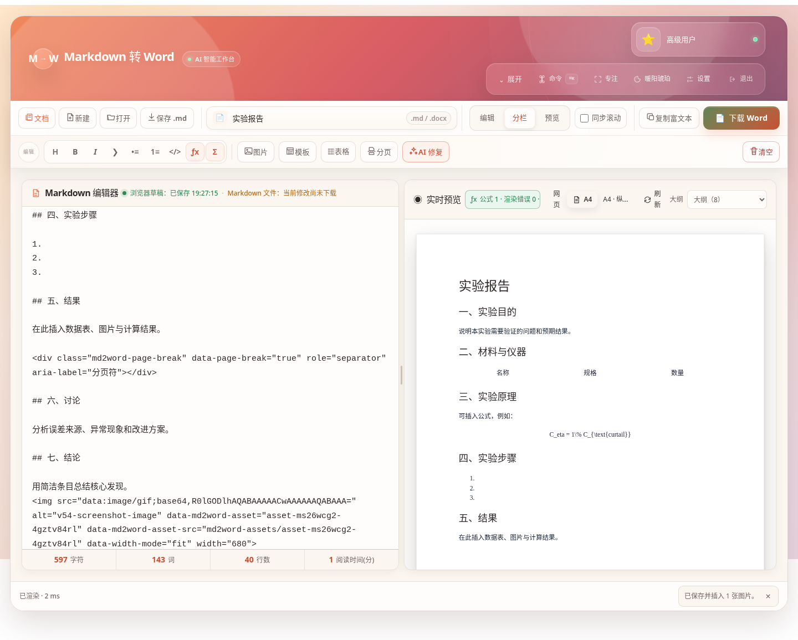
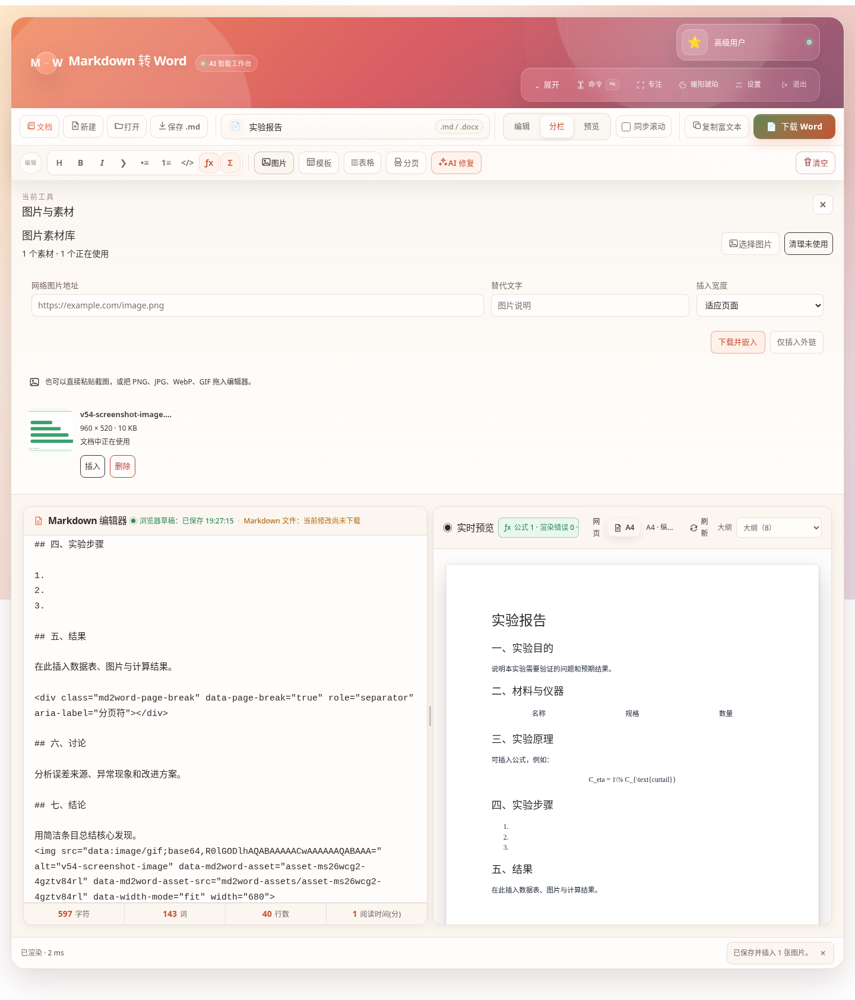
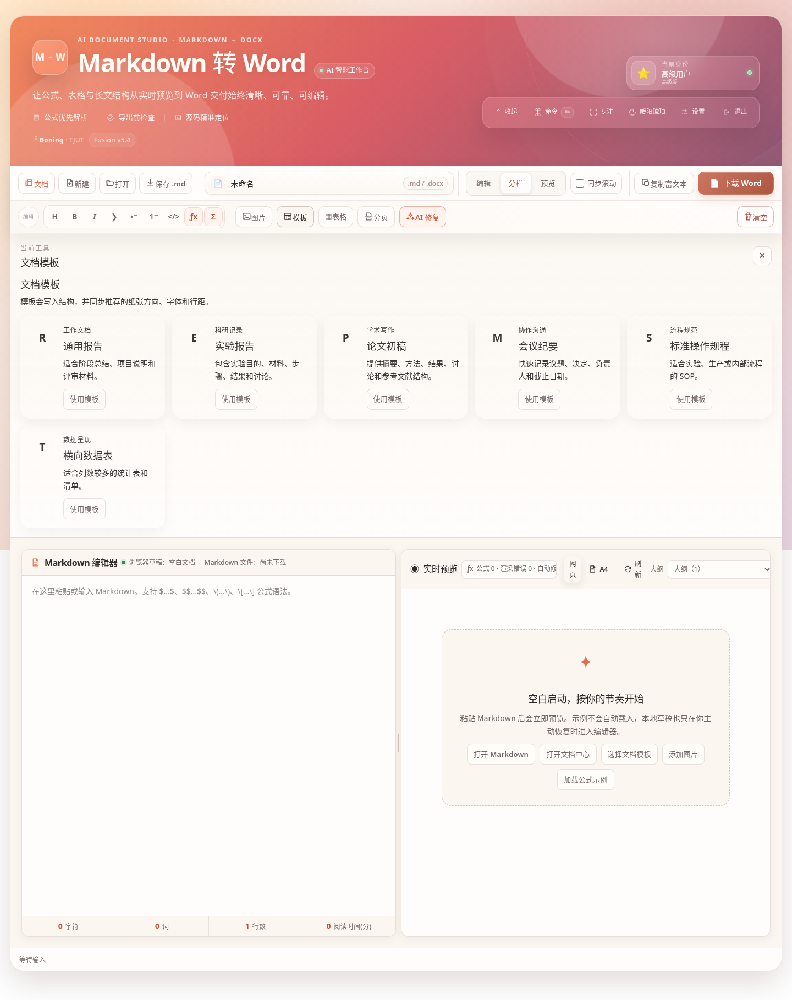
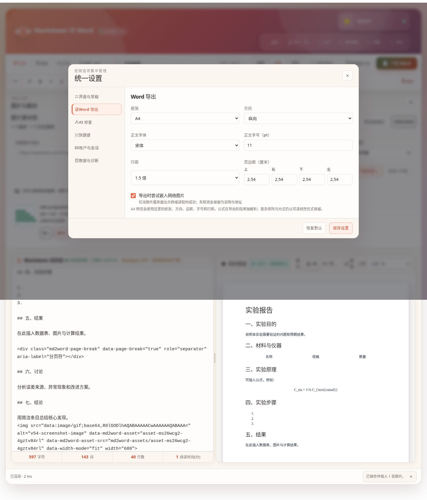
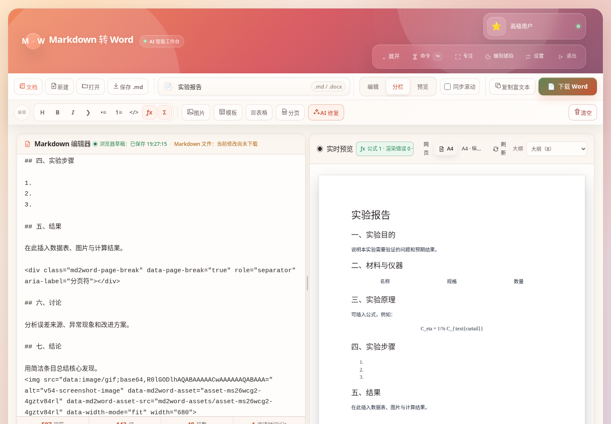
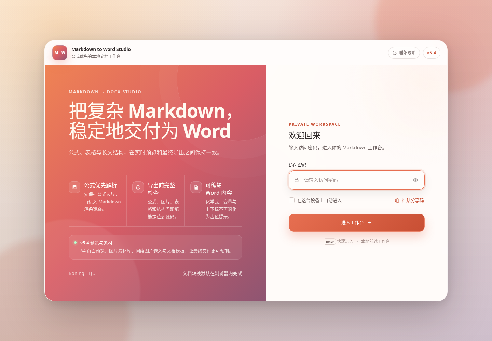
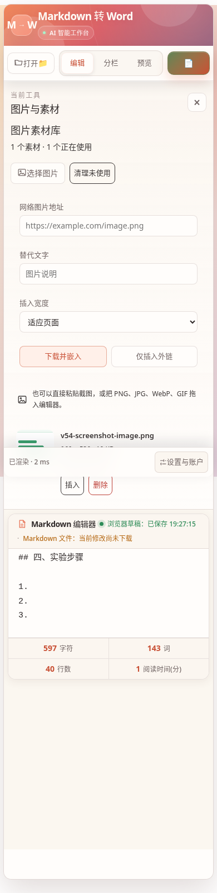

# AI 智能 Markdown 转 Word · 融合体验版 v5.4

一个完全运行在浏览器中的 Markdown 编辑、预览与 Word 导出工作台。项目保留原版密码入口、玻璃态视觉、三种本地身份、四套主题和常驻 Command Deck，并在可靠公式、多文档中心、版本历史和导出前检查之上，新增 **A4 / Letter 页面预览、图片素材库、网络图片嵌入、文档模板、显式分页和长文性能模式**。

无需后端，也无需构建。打开静态页面即可使用；AI 修复为可选能力。

## v5.4 的重点：预览结果更接近最终交付

### A4 / Letter 页面预览

预览区现在可以在两种模式间切换：

```text
网页预览    A4 页面预览
```

页面预览会同步当前 Word 设置：

- A4 或 Letter；
- 纵向或横向；
- 上、右、下、左四个独立页边距；
- Word 字体、字号和行距；
- 显式分页符；
- 预计页数；
- 图片、表格等可能超出可用页面宽度的提醒。

A4 预览采用浏览器中的块级分页估算，用于提前发现布局风险；最终分页仍以 Microsoft Word 或 WPS 的排版引擎为准。



### 图片粘贴、拖入和素材库

图片不再只是一个外部地址。v5.4 为每份文档建立独立本地素材库：

- 直接从剪贴板粘贴截图；
- 拖入 PNG、JPG、GIF、WebP 或 SVG；
- 从文件选择器一次导入多张图片；
- 从网络地址下载并保存为本地素材；
- 也可只插入普通外部图片地址；
- 选择小、中、适应页面或原始尺寸；
- 查看素材尺寸、体积和使用状态；
- 重新插入已有素材；
- 清理未使用素材；
- 删除素材时同步处理文档引用。

WebP、SVG 或超大图片会在浏览器中转换、缩放为更适合 Word 的格式。单张原图上限为 20 MB，处理后上限为 10 MB，默认最长边不超过 2200 像素；单个文档最多保存 200 个图片素材。

本地图片随文档副本、工作区备份和恢复一起迁移，Word 导出时会直接嵌入。网络图片能否自动下载取决于图片服务器是否允许跨域读取；失败时导出检查会明确提示。



### 文档模板

内置六种结构模板：

| 模板 | 适用场景 |
|---|---|
| 通用报告 | 阶段总结、项目说明、评审材料 |
| 实验报告 | 实验目的、材料、步骤、结果与讨论 |
| 论文初稿 | 摘要、方法、结果、讨论和参考文献 |
| 会议纪要 | 议题、决定、负责人和截止日期 |
| 标准操作规程 | 实验、生产或内部流程 SOP |
| 横向数据表 | 列数较多的统计表和清单 |

模板不仅写入 Markdown 结构，还会同步推荐的纸张方向、字体、字号、行距和页边距。应用模板前，如果当前文档已有内容，会先创建历史保护点并要求确认。



### 显式分页

工具栏和“更多”菜单都提供“分页”。插入后，Markdown 中会写入一个稳定的分页标记：

```html
<div class="md2word-page-break" data-page-break="true" role="separator" aria-label="分页符"></div>
```

该标记会同时影响：

- 网页预览中的分页提示；
- A4 页面预览；
- Word 导出中的真实 `PageBreak`；
- 连续分页和文档末尾空白页。

快捷键：

```text
Alt + P    插入分页符
```

### 长文性能模式

设置中新增四种预览策略：

| 模式 | 行为 |
|---|---|
| 自动选择 | 普通文档实时预览，超过约 3 万字符后自动进入长文优化 |
| 始终实时 | 输入后快速更新预览 |
| 长文优化 | 延长防抖，降低公式、分页和结构检查频率 |
| 手动刷新 | 编辑时不自动重排，点击“刷新预览”后更新 |

手动模式下，预览标题栏会显示待刷新状态，不会让用户误以为右侧已经同步。



## 多文档与可靠恢复

v5.4 延续并增强 v5.3 的本地工作流：

- 多文档中心；
- 文档搜索、打开、复制和删除；
- 每份文档独立保存光标、滚动位置和视图；
- 最多保留最近 30 个历史版本；
- AI 应用、清空、公式标准化、模板替换和历史恢复前创建保护点；
- 智能粘贴 Markdown 围栏、TSV 和富文本；
- 完整工作区 JSON 备份；
- API Key 默认排除；
- IndexedDB 优先，localStorage 和临时内存降级。

### v5.3 数据迁移

首次运行 v5.4 时，会尽力迁移 v5.3 的：

```text
IndexedDB：md2word-workspace-v5.3
localStorage：md2word.workflow.documents.v5.3
当前文档：md2word.workflow.current.v5.3
```

迁移内容包括文档、嵌入式历史版本、光标位置和最后打开文档。旧数据不会被主动删除；v5.4 中已经存在的同 ID 文档也不会被旧数据覆盖。

覆盖更新前仍建议先下载重要 Markdown，或在 v5.3 中导出一次工作区备份。

## 可靠公式链路

公式会在 Markdown 解析前被提取和保护，因此 `\[...\]`、`\(...\)` 不会被 Marked 当作普通反斜杠转义处理。

支持：

```text
行内：$x_1$ 或 \(x_1\)
独立：$$...$$ 或 \[...\]
```

兼容 AI 输出中的常见退化：

```latex
[
\text{玻片–O–Si–(CH}_2)_3
]
```

以及：

```latex
(C_\eta=1%C_{\text{curtail}})
```

高置信度裸公式会自动补充边界，并把公式上下文中的数值百分号规范为 `\%`。公式诊断可以显示公式数量、渲染错误、自动修复原因，并一键定位原始 Markdown 或写回标准语法。

代码块、行内代码、普通括号说明、Markdown 链接、普通函数调用和 HTML 属性不会被误转换。

## Word 导出闭环

下载前会检查：

- 公式渲染错误和未闭合边界；
- 未闭合代码围栏；
- 标题层级跳跃；
- 超宽表格；
- 空链接；
- 缺失的本地图片素材；
- `blob:`、相对路径和不稳定图片地址；
- 网络图片下载失败；
- A4 页面宽度溢出；
- 复杂公式将被线性化的兼容性提醒。

Word 导出会使用当前纸张、方向和四边页边距；图片宽度会限制在可打印区域以内。化学式、变量下标和常见上标会生成可编辑 `TextRun`，不再插入“请手动添加公式”的占位提示。

复杂分式、矩阵、积分和多行方程目前仍会转换为可编辑线性文本，而不是 Word 原生 OMML 公式对象。

## 界面与交互

- 高级双栏密码入口；
- 登录前主题切换、分享码和本机自动进入；
- 原版玻璃态品牌区与四套主题；
- 常驻双层 Command Deck；
- Word 是唯一高亮主按钮；
- 编辑、分栏、预览三种视图；
- 桌面与手机分别记忆视图；
- 可拖动分隔条并记忆宽度；
- 可关闭同步滚动；
- 预览顶部大纲下拉框；
- 八级全局字体系统；
- 紧凑、标准、宽松三种界面密度；
- `Ctrl / Command + K` 全局命令面板；
- `Ctrl / Command + Shift + F` 专注模式；
- AI 选区或全文修复；
- TSV、CSV 与 Markdown 表格转换；
- Word 导出成功回执。



## 默认本地身份

| 密码 | 身份 |
|---|---|
| `basic123` | 基础用户 |
| `517517` | 高级用户 |
| `lingling` | 超级管理员 |

三个身份均可使用核心编辑、公式、图片和导出能力。密码和身份名称统一在：

```text
js/access-config.js
```

密码入口用于保留个人工作流与界面体验，不是服务器级安全认证。

## 快速使用

1. 输入密码进入工作区；
2. 新建、打开或从文档中心继续文档；
3. 选择模板，或直接粘贴 Markdown；
4. 粘贴、拖入或从素材库插入图片；
5. 在网页预览中检查内容，在 A4 预览中检查页面；
6. 查看 Word 按钮的导出状态；
7. 点击“下载 Word”。

常用快捷键：

```text
Ctrl / Command + K           命令面板
Ctrl / Command + O           打开 Markdown
Ctrl / Command + S           下载 Markdown
Ctrl / Command + D           下载 Word
Ctrl / Command + Enter       复制富文本
Ctrl / Command + Shift + F   专注模式
Ctrl / Command + B           粗体
Ctrl / Command + I           斜体
Alt + M                      插入独立公式
Alt + P                      插入分页符
```

## 本地运行

```bash
git clone https://github.com/zxcgzx/markdown-to-word-converter.git
cd markdown-to-word-converter
python -m http.server 8000
```

浏览器打开 `http://localhost:8000`。

页面通过 CDN 加载 Marked、DOMPurify、KaTeX、docx.js 和 FileSaver，因此首次打开以及 Word 导出需要能够访问这些依赖。文档、版本和本地图片素材保存在当前浏览器中。

## 自动检查

```bash
npm run check
npm test
```

当前发布版结果：

```text
JavaScript 语法：7 / 7 通过
Node 自动测试：118 / 118 通过
Chromium 主集成：79 / 79 通过
Chromium 主题与布局矩阵：91 / 91 通过
页面运行错误：0
控制台错误：0
```

完整记录见 [质量检查报告](docs/QA_REPORT.md)。

## 项目结构

```text
.
├── index.html
├── css/
│   ├── app.css
│   ├── toolbar.css
│   ├── experience.css
│   ├── hero.css
│   ├── typography.css
│   ├── workflow.css
│   └── publishing.css
├── js/
│   ├── access-config.js
│   ├── math-engine.js
│   ├── preflight.js
│   ├── workspace-store.js
│   ├── assets.js
│   ├── publishing.js
│   └── app.js
├── tests/
├── docs/
│   ├── UPDATE_GUIDE.md
│   ├── QA_REPORT.md
│   └── screenshots/
├── package.json
└── .github/workflows/deploy.yml
```

## 更多界面预览

### 密码入口



### 模板中心


### 手机工作区



## 当前边界

- A4 页面预览是浏览器中的块级分页估算，不是 Word 排版引擎的像素级复制；
- 远程图片自动嵌入依赖图片服务器允许 CORS；
- 复杂数学公式仍不是 Word 原生 OMML；
- AI 请求取决于服务商接口、模型、API Key、配额和 CORS；
- 外部 CDN 受实际网络环境影响；
- localStorage 降级模式不适合大量图片，图片较多时应使用支持 IndexedDB 的现代浏览器；
- 自动化测试不能替代实际 Microsoft Word / WPS、真实 CDN 和真实 AI 接口验收。

## License

MIT
