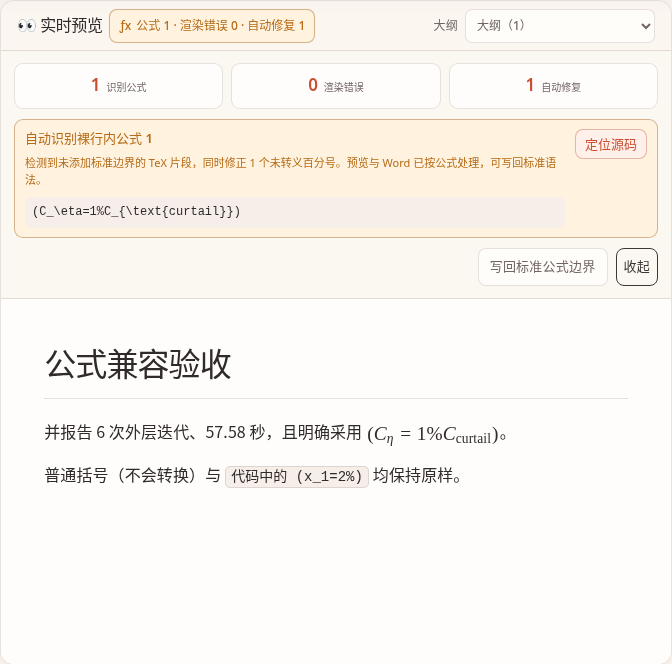
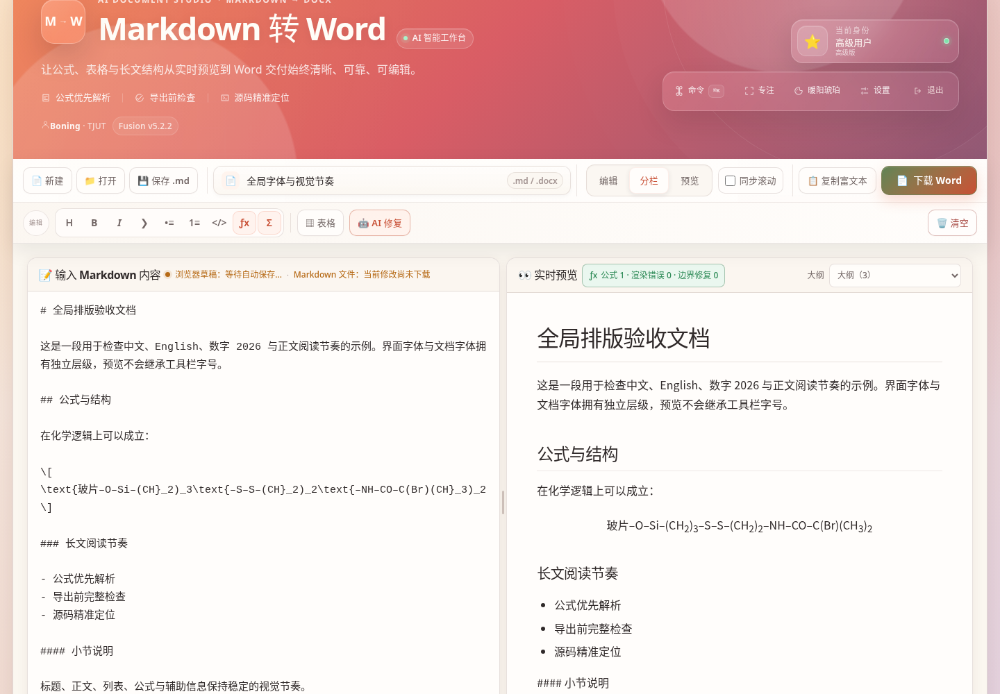
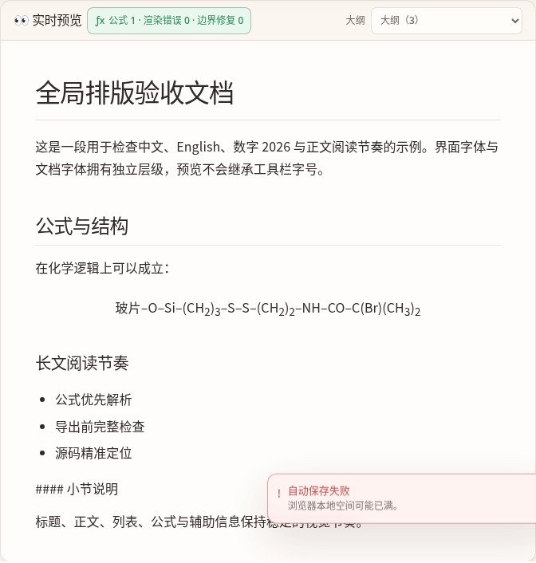
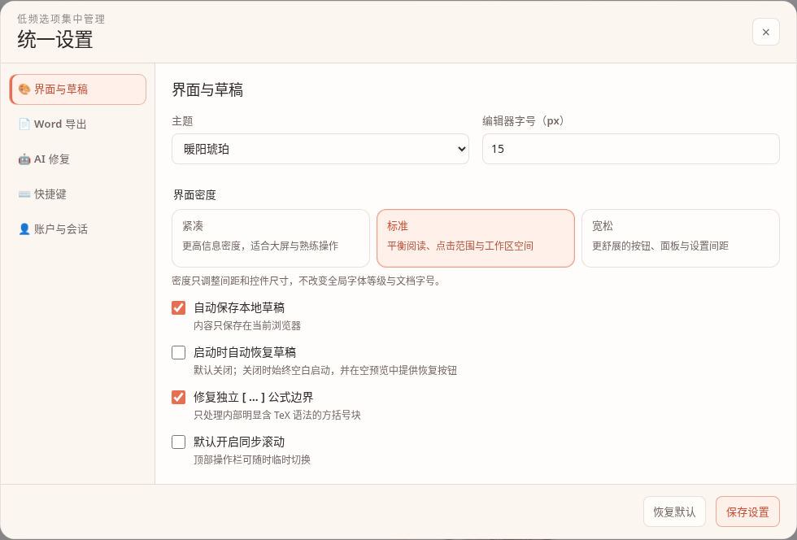

# AI 智能 Markdown 转 Word · 融合体验版 v5.2.3

一个完全运行在浏览器中的 Markdown 编辑、实时预览与 Word 导出工作台。项目保留密码入口、三种本地身份、四套主题、原版玻璃态视觉与 v5.2.2 全局字体系统，同时提供公式预保护、导出前检查、源码定位、可编辑 Word 上下标、AI 修复、表格转换、命令面板和专注模式。

无需后端，也无需构建。打开静态页面即可使用；AI 修复为可选能力。

## v5.2.3：修复截图中的裸行内公式

旧版遇到下面这类 AI 输出时，会把它当作普通文字：

```latex
(C_\eta=1%C_{\text{curtail}})
```

这里叠加了两个问题：

1. 外层只有普通括号，没有 `$...$` 或 `\(...\)` 公式边界；
2. TeX 中 `%` 是注释符，数值百分号应写成 `\%`。

v5.2.3 会在括号内部具有高置信度 TeX 结构时自动识别，并在渲染阶段规范为：

```latex
\((C_\eta=1\%C_{\text{curtail}})\)
```

同时保留原始源码范围，因此可以：

- 在预览中直接得到 KaTeX 公式，而不是显示源码；
- 在公式诊断中看到“自动识别裸行内公式”；
- 一键定位原始 Markdown；
- 一键写回标准公式边界和百分号转义；
- 在 Word 中把 `η` 与 `curtail` 生成为可编辑下标。

普通括号说明、Markdown 链接、普通函数调用、行内代码和围栏代码块不会被误转换。中文全角括号和全角百分号也已兼容。


## 主要能力

### 可靠公式链路

- 在 Marked 解析前保护 `$...$`、`$$...$$`、`\(...\)`、`\[...\]`；
- 自动兼容退化成独立 `[ ... ]` 的 TeX 公式块；
- 自动兼容括号中的高置信度裸行内 TeX；
- 仅在公式上下文中修正可确认的数值百分号；
- 排除代码块和行内代码；
- 显示公式数、渲染错误数与自动修复数；
- 公式错误和自动修复项均可定位源码；
- 支持把自动修复结果写回标准 Markdown/TeX 语法。

### Word 导出闭环

- 下载 Word 前检查公式、代码围栏、图片、表格、链接和标题层级；
- Word 按钮显示“检查通过 / 有提醒 / 有错误”；
- 常见化学式、变量下标、上标和符号生成为可编辑文字运行；
- 不再插入“请手动添加公式”的占位提示；
- 复杂分式、矩阵和多行方程仍以可编辑线性文本导出。

### 高级操作体验

- 双栏品牌密码入口、分享码、本机自动进入与登录前主题切换；
- 连续式双层 Command Deck，Word 是唯一主按钮；
- 默认空白启动，示例只在空预览中提供；
- 可拖动分栏并分别记忆桌面与手机视图；
- 可开关同步滚动与大纲下拉导航；
- `Ctrl / Command + K` 全局命令面板；
- `Ctrl / Command + Shift + F` 专注模式；
- 紧凑、标准、宽松三种界面密度；
- 独立的 UI、编辑器、Markdown 预览和 Word 字体体系。

## 界面预览

### v5.2.3 公式结果



### 桌面工作区与全局排版



### Markdown 文档排版层级



### 字体与界面密度设置



### 高级双栏密码入口


### 手机端


## 默认本地身份

| 密码 | 身份 |
| --- | --- |
| `basic123` | 基础用户 |
| `517517` | 高级用户 |
| `lingling` | 超级管理员 |

统一修改位置：

```text
js/access-config.js
```

密码入口只是个人纯前端工作台的使用门槛，不是服务器级安全认证。

## 使用方法

1. 输入密码进入工作区；
2. 粘贴、输入或打开 Markdown；
3. 在预览区确认公式、标题、表格和结构；
4. 查看 Word 按钮的导出就绪状态；
5. 点击“下载 Word”。

推荐优先使用标准公式语法：

```latex
行内：\(x_1=25\%\)
独立：\[x_1=25\%\]
```

v5.2.3 的自动识别用于兼容 AI 输出，不替代规范书写。

常用快捷键：

```text
Ctrl / Command + O       打开 Markdown
Ctrl / Command + S       下载 Markdown
Ctrl / Command + D       下载 Word
Ctrl / Command + Enter   复制富文本
Ctrl / Command + K       命令面板
Ctrl / Command + Shift+F 专注模式
Alt + M                  插入独立公式
```

## 本地运行

```bash
git clone https://github.com/zxcgzx/markdown-to-word-converter.git
cd markdown-to-word-converter
python -m http.server 8000
```

浏览器打开 `http://localhost:8000`。

页面通过 CDN 加载 Marked、DOMPurify、KaTeX、docx.js 和 FileSaver，首次使用需要网络连接。

## 自动检查

```bash
npm test
npm run check
```

v5.2.3 发布前完成：

- 94 项 Node 自动测试；
- 81 项 Chromium 公式、响应式和 Word 转换集成检查；
- 4 个 JavaScript 文件语法检查；
- 135 个 HTML ID 唯一性检查；
- 111 个直接 DOM 引用检查；
- 9 个本地资源检查；
- 5 个 CSS 文件解析与声明检查；
- 最终 ZIP 完整性检查，以及从全新目录解压后的复测。

完整结果见 [`docs/QA_REPORT.md`](docs/QA_REPORT.md)。

## 项目结构

```text
.
├── index.html
├── css/
│   ├── app.css
│   ├── toolbar.css
│   ├── experience.css
│   ├── hero.css
│   └── typography.css
├── js/
│   ├── access-config.js
│   ├── math-engine.js
│   ├── preflight.js
│   └── app.js
├── tests/
├── docs/
├── package.json
└── .github/workflows/deploy.yml
```

## 浏览器兼容性

建议使用当前版本的 Chrome、Edge 或 Firefox。较旧浏览器对 `<dialog>`、Clipboard API、CSS `color-mix()` 和文件下载能力的支持可能不完整。

## License

MIT
