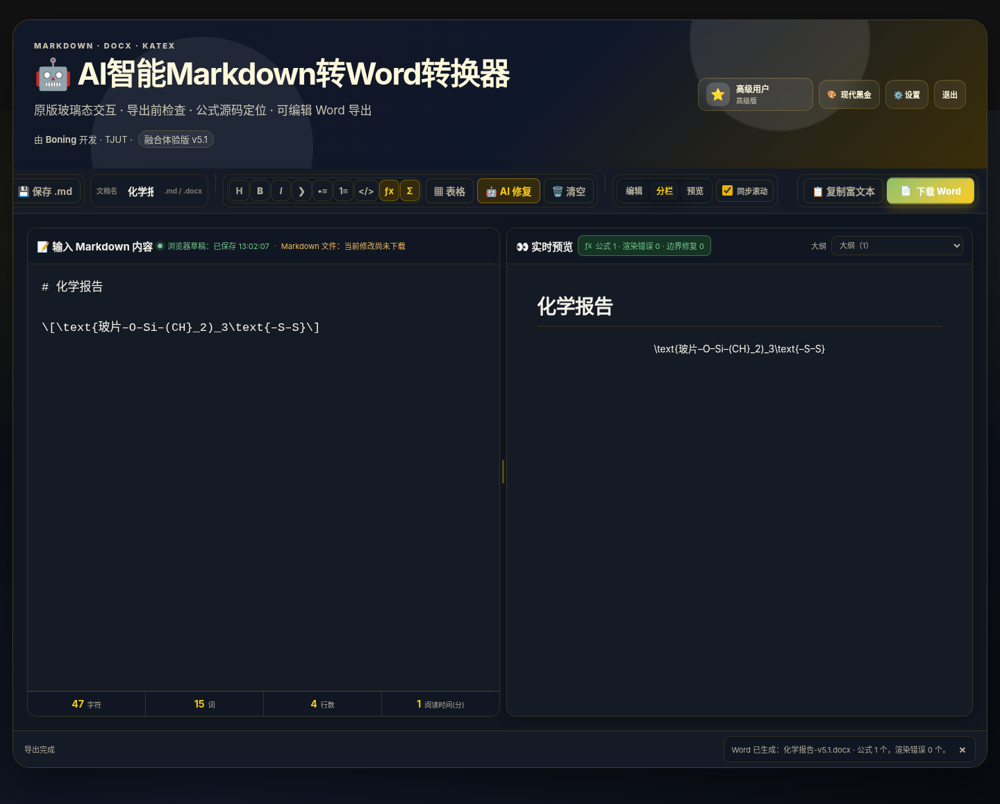
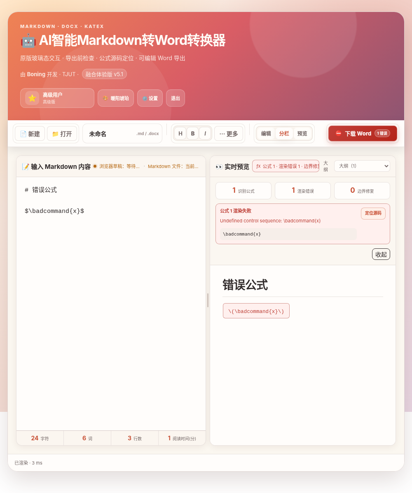

# AI 智能 Markdown 转 Word · 融合体验版 v5.1

一个完全在浏览器中运行的 Markdown 编辑、实时预览与 Word 导出工具。v5.1 延续原版的密码入口、玻璃态卡片、渐变标题区、用户身份和四套主题，在 v5 的聚焦式工作流上补齐了三条关键闭环：**问题能在导出前发现、公式错误能直接定位源码、保存状态不会再产生歧义**。

无需后端，也无需构建。打开静态页面即可使用；AI 修复属于可选能力。

## 界面预览

### 密码入口


### 桌面端工作区



### 公式诊断与源码定位



### 移动端工作区


## v5.1 核心改进

### 1. 导出前检查与 Word 按钮就绪状态

“下载 Word”仍是页面唯一主按钮，但现在会实时反映文档状态：

```text
下载 Word                 检查通过
下载 Word · 2 提醒        可以导出，但建议检查
下载 Word · 1 错误        先处理阻断问题，或明确选择仍然导出
```

检查项包括：

- KaTeX 公式渲染错误；
- 未闭合的 `\[...\]`、`\(...\)`、`$$...$$` 等公式边界；
- 未闭合的围栏代码块；
- 复杂公式在 Word 中将被线性化的兼容性提醒；
- 标题层级跳跃；
- 超宽 Markdown 表格；
- 空链接、空图片地址和无法直接嵌入 Word 的网络图片。

存在问题时，首次点击主按钮会打开工作区内联检查面板，而不是直接生成一个可能有问题的文件。每条可定位问题都能跳回对应源码；熟悉风险后仍可选择“仍然导出”。

### 2. 公式错误一键定位源码

公式引擎现在保存每个公式在原始 Markdown 中的精确起止位置。无论错误来自标准边界还是自动修复后的独立 `[ ... ]` 公式块，都可以：

- 在公式诊断中点击“定位源码”；
- 直接点击预览中的错误公式；
- 自动切换到编辑或分栏视图；
- 选中对应 Markdown；
- 滚动到该位置，并显示行号、列号。

独立 `[ ... ]` 公式的自动标准化只插入缺少的反斜杠，不会破坏原始缩进、空行或源码位置映射。

### 3. 可编辑文档名与两种保存状态

顶部新增轻量文档名输入框。它同时用于：

- 下载 `.md` 的文件名；
- 下载 `.docx` 的文件名；
- 打开文件后的默认名称；
- 恢复浏览器草稿时的文档名称。

保存状态明确分为：

- **浏览器草稿**：自动保存到当前浏览器；
- **Markdown 文件**：用户已经主动下载 `.md` 文件。

因此“草稿已保存”不再被误解为“磁盘文件已经保存”。

### 4. 窄桌面的“更多”菜单

在 681～1180 像素的窄桌面或平板宽度下，低频格式工具不会静默消失，而是进入“更多”菜单。常用操作仍保持可见，功能也仍然可发现。

### 5. 桌面与移动端分别记忆视图

- 桌面端记忆自己的编辑、分栏或预览模式；
- 移动端使用独立设置，首次默认进入编辑模式；
- 手机不会因为桌面上一次选择了分栏而自动进入过长的纵向双栏；
- 分隔条比例也继续按不同屏幕类别分别保存。

### 6. 唯一设置窗口改为分类导航

低频选项仍集中在一个设置对话框中，但内部明确划分为：

- 界面与草稿；
- Word 导出；
- AI 设置；
- 快捷键；
- 账户。

支持鼠标、键盘和左右方向键切换分类。表格与 AI 结果仍在工作区内联展开，不会再叠加多层模态框。

## 延续自 v5 的聚焦式体验

- 常驻顶部操作栏，按“文件、编辑、视图、输出”分组；
- “下载 Word”是唯一高亮主按钮；
- 默认空白启动，示例和草稿恢复只出现在空预览；
- 大纲下拉框取代悬浮缩略图；
- 可拖动、可键盘调整、可双击重置的分栏；
- 可关闭的编辑与预览同步滚动；
- 公式总数、渲染错误、边界修复数和具体诊断；
- 普通反馈进入紧凑状态栏，只有真实错误显示错误卡片；
- 手机顶部只保留打开、视图切换和 Word 下载；
- DOCX 导出单独解析公式，并生成可编辑上下标文本。

## 保留的原版模式

- 密码验证、密码显示切换、Enter 登录和分享码粘贴；
- 基础用户、高级用户、超级管理员三种本地身份；
- 暖阳琥珀、经典浅林、现代黑金、极光幻彩四套主题；
- 原版风格的渐变标题、玻璃态卡片和双栏编辑预览；
- 本地草稿、文件拖放、Markdown 下载、富文本复制、AI 修复和表格转换。

三个身份目前都能使用全部核心功能。身份等级只用于保留入口体验和身份显示，不限制公式、AI 或导出。

## 默认访问密码

密码统一配置在 `js/access-config.js`：

| 密码 | 显示身份 |
| --- | --- |
| `basic123` | 基础用户 |
| `517517` | 高级用户 |
| `lingling` | 超级管理员 |

修改示例：

```js
window.MD2WORD_ACCESS = Object.freeze({
    sessionKey: 'md2word.fusion.auth.v5.1',
    users: Object.freeze({
        '我的密码': Object.freeze({
            level: 'advanced',
            name: '我的身份',
            icon: '⭐',
            label: '个人版'
        })
    })
});
```

密码和身份完全位于前端配置中，适用于个人使用和轻量入口区分。

## 推荐工作流

1. 输入密码进入应用；
2. 直接粘贴 Markdown，或点击顶部“打开”；
3. 在文档名输入框确认输出文件名；
4. 使用编辑、分栏或预览模式检查内容；
5. 查看公式状态与 Word 主按钮的就绪状态；
6. 有问题时点击诊断项定位源码；
7. 检查通过后下载 Word。

## 公式支持

公式在进入 Marked 前被识别和保护，再完成 Markdown 解析、净化与 KaTeX 渲染，因此不会再因为 Markdown 反斜杠转义而丢失边界。

支持：

```text
$...$
$$...$$
\(...\)
\[...\]
```

也支持识别 AI 输出中已经退化的独立 TeX 块：

```text
[
\text{玻片–O–Si–(CH}_2)_3
]
```

代码围栏和行内代码中的公式标记会保持原样。公式状态栏使用更明确的文案：

```text
公式 3 · 渲染错误 1 · 边界修复 0
```

## Word 公式导出

DOCX 导出不会读取 KaTeX 的重复视觉文本，也不会插入“请手动添加公式”的占位提示。公式会在导出阶段重新解析：

- `_2`、`_{12}` 转为 Word 下标；
- `^2`、`^{n}` 转为 Word 上标；
- 化学式、变量与常用符号保持可编辑；
- 标题、段落、列表、引用、表格、代码和链接按 Word 结构生成。

当前目标是“可读、可编辑、上下标正确”。复杂分式、矩阵、积分和多行方程会以线性可编辑文本保留，尚不是 Word 原生 OMML 公式对象；导出前检查会对此给出兼容性提醒。

## 草稿与文件

- 默认空白启动；
- 自动保存可在设置中开关；
- 本地存在草稿时，空预览区显示“恢复草稿”；
- 可选择启动时自动恢复；
- 新建、打开、恢复和下载都同步维护文档名；
- 浏览器存储访问已增加异常保护，在禁用或受限存储环境中不会直接中断应用。

## AI 与表格工具

- AI 修复优先处理当前选区，没有选区时处理全文；
- AI 设置集中管理服务商、接口、模型、API Key 和默认模式；
- AI 结果在工作区内联对比、编辑、复制或应用；
- 表格工具支持 TSV、CSV 和 Markdown 表格的转换、预览与插入；
- API 配置只保存在当前浏览器；请求能否成功取决于所配置服务商、模型、Key 和浏览器跨域策略。

## 快捷键

| 快捷键 | 功能 |
| --- | --- |
| `Ctrl / Command + O` | 打开 Markdown 文件 |
| `Ctrl / Command + S` | 下载 `.md` |
| `Ctrl / Command + D` | 下载 Word |
| `Ctrl / Command + Enter` | 复制富文本 |
| `Ctrl / Command + B` | 粗体 |
| `Ctrl / Command + I` | 斜体 |
| `Ctrl / Command + /` | 打开设置中的快捷键分类 |
| `Alt + M` | 插入独立公式 |
| 双击分隔条 | 恢复左右均分 |

## 本地运行

项目无需构建，建议通过本地 HTTP 服务打开：

```bash
python -m http.server 8000
```

浏览器访问：

```text
http://localhost:8000
```

运行时通过 CDN 加载 Marked、DOMPurify、KaTeX、docx.js 和 FileSaver，因此首次打开需要能够访问对应 CDN。

## 自动检查

安装 Node.js 后，在项目根目录运行：

```bash
npm test
npm run check
```

当前自动测试共 **47 项**：

- `tests/fusion-static.test.js`：16 项页面结构、入口、响应式与工作流测试；
- `tests/math-engine.test.js`：16 项公式提取、修复、源码映射与 Word 文本测试；
- `tests/preflight.test.js`：15 项导出前检查、位置计算与边界测试。

`npm run check` 会对四个本地 JavaScript 文件执行语法检查。

## 项目结构

```text
.
├── index.html
├── css/
│   └── app.css
├── js/
│   ├── access-config.js
│   ├── app.js
│   ├── math-engine.js
│   └── preflight.js
├── tests/
│   ├── fusion-static.test.js
│   ├── math-engine.test.js
│   └── preflight.test.js
├── docs/
│   ├── screenshots/
│   ├── UPDATE_GUIDE.md
│   └── QA_REPORT.md
├── .github/workflows/deploy.yml
├── package.json
├── CHANGELOG.md
└── LICENSE
```

## 浏览器兼容性与验收说明

建议使用当前版本的 Chrome、Edge 或 Firefox。页面使用 `<dialog>`、Clipboard API、File API、Pointer Events 和浏览器下载能力。

仓库附带的自动检查覆盖本地逻辑、静态结构和响应式交互。由于自动化环境不能直接验证所有外部 CDN 与所有 Word/WPS 版本，部署后仍建议完成三项人工验收：

1. 确认实际网络环境可加载 CDN 依赖；
2. 下载一个包含化学式和上下标的 DOCX，并用目标 Word 或 WPS 打开；
3. 使用自己的 AI 服务配置完成一次真实请求。

## License

MIT
