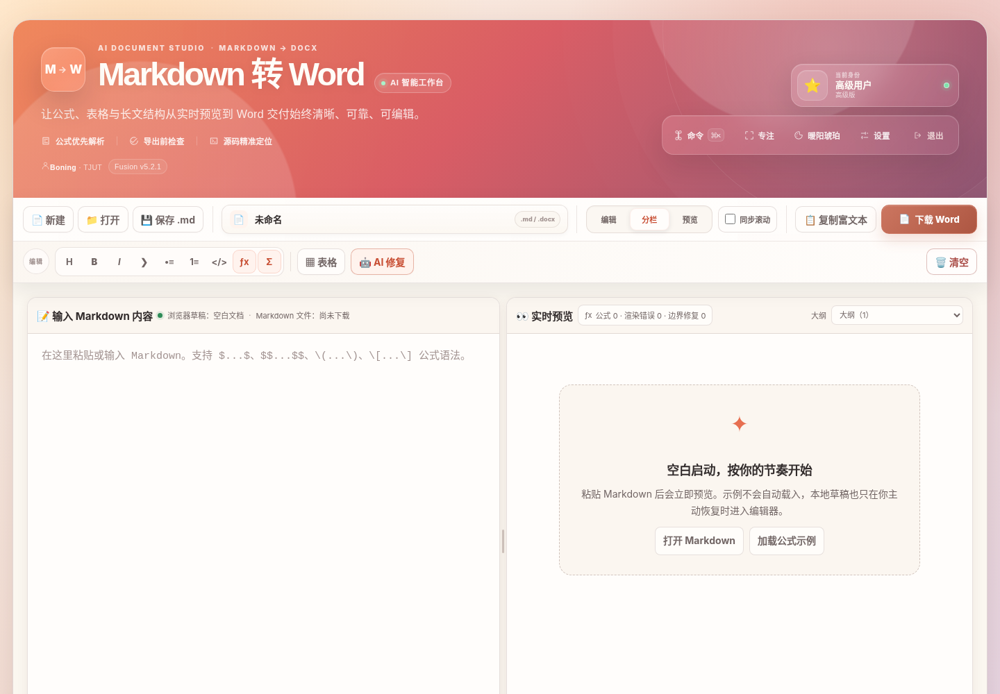
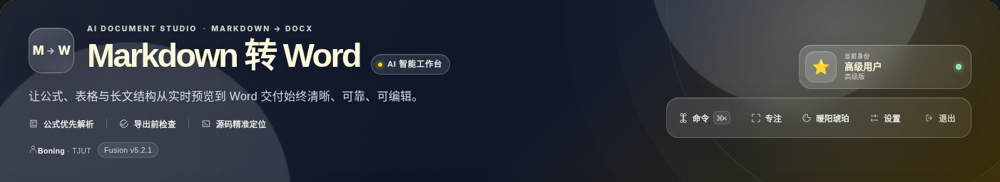
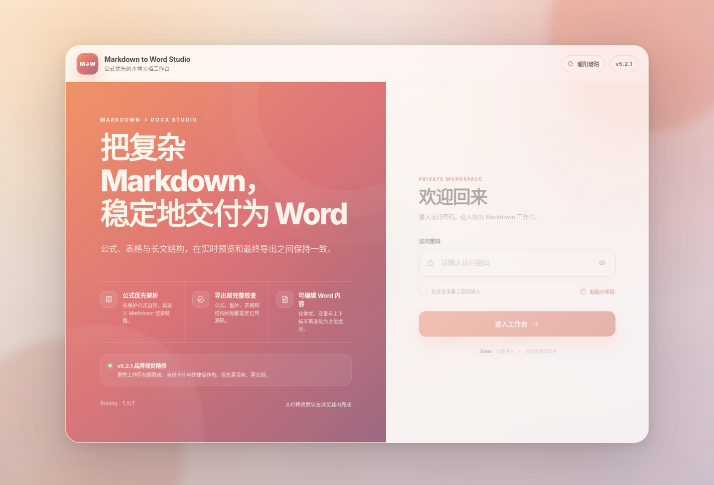
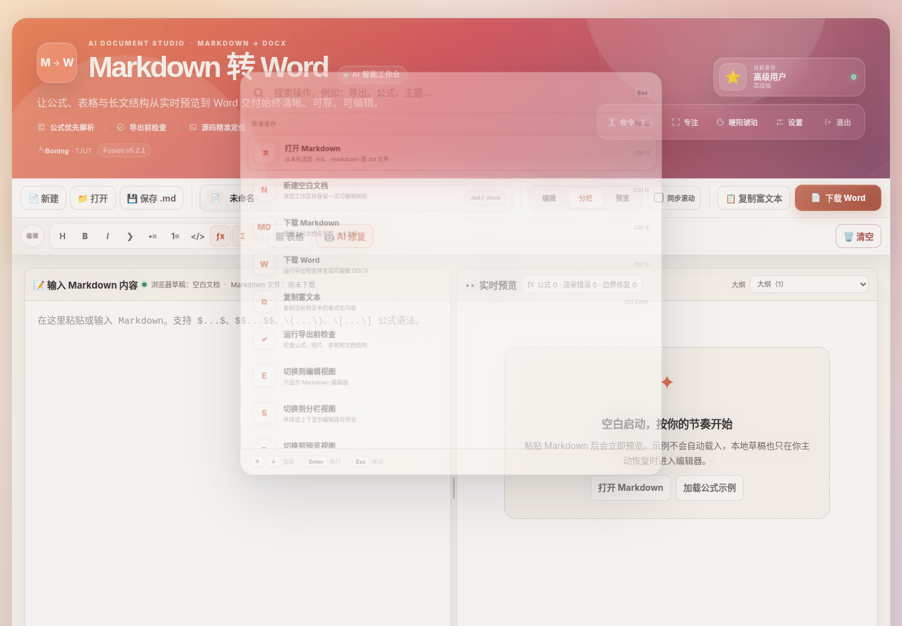
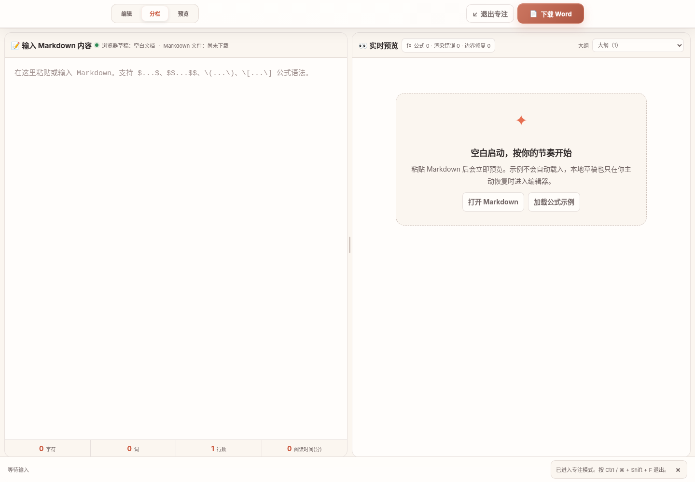
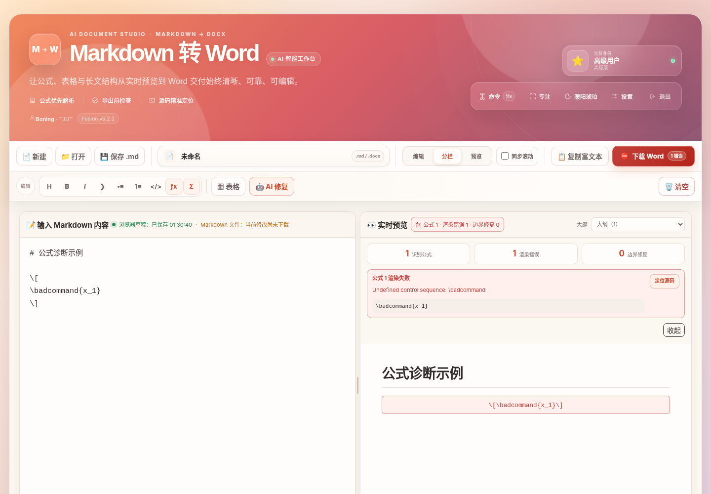

# AI 智能 Markdown 转 Word · 融合体验版 v5.2.1

一个完全运行在浏览器中的 Markdown 编辑、实时预览与 Word 导出工作台。项目保留密码入口、玻璃态主题、三种本地身份与四套配色，同时提供公式预保护、导出前检查、源码定位、可编辑 Word 上下标、AI 修复、表格转换和响应式 Command Deck。

v5.2.1 聚焦主工作区顶部的品牌表达与操作层级：不增加新按钮，而是把过长标题、分散身份卡和独立按钮重新组织为一套更克制的品牌锁定区与快捷操作坞。

- 主标题精简为 `Markdown 转 Word`，以 `AI 智能工作台` 作为低权重状态标识；
- 使用独立 `M→W` 品牌徽记，移除标题中的 Emoji；
- 公式解析、导出检查与源码定位收敛成一条轻量能力轨道；
- 身份信息与命令、专注、主题、设置、退出整合为统一玻璃态操作坞；
- 320～1920 像素与四套主题均完成布局、点击命中和溢出检查。

无需后端，也无需构建。打开静态页面即可使用；AI 修复是可选能力。

## 界面预览

### v5.2.1 桌面工作区



### 精修后的顶部品牌区


### 现代黑金主题



### 手机端紧凑标题


### 高级双栏密码入口



### 全局命令面板与专注模式





### 公式诊断与源码定位



## v5.2.1 工作区品牌视觉精修

### 1. 从功能长标题改为产品锁定区

旧标题将 Emoji、AI、Markdown、Word 和“转换器”全部放在同一视觉层，宽屏仍可能换行。新版拆分为：

```text
M→W 品牌徽记
AI DOCUMENT STUDIO · MARKDOWN → DOCX
Markdown 转 Word          AI 智能工作台
```

主标题保持单行，AI 属性作为安静的状态徽标，不再与产品名争抢层级。

### 2. 更适合中英文混排的字体与字距

标题优先使用系统可用的 Display 字体、苹方、HarmonyOS Sans SC 与 Microsoft YaHei UI，控制字重、负字距和行高；不依赖外部字体服务，因此不会增加 CDN 失败点。

### 3. 能力信息不再堆成说明卡

“公式优先解析、导出前检查、源码精准定位”改成带细分隔线的能力轨道。它们提供产品可信度，但不会压过文档编辑与 Word 下载主流程。

### 4. 身份与快捷操作形成一个整体

当前身份使用独立状态卡，下面的命令、专注、主题、设置和退出放入一个统一操作坞。按钮不再像五张互相竞争的卡片，同时仍保留完整标签、快捷键提示、键盘焦点和点击区域。

### 5. 响应式行为

- 1120 像素以上保持左右双区；
- 1120 像素及以下将身份与操作坞放到品牌内容下方；
- 820 像素及以下让操作坞占满可用宽度；
- 680 像素及以下隐藏次要身份和快捷入口，只保留紧凑产品名与一句价值说明；
- 主标题在所有测试宽度保持受控，不会出现“转换器”孤立换行。

## v5.2 品牌入口与高级交互

### 1. 品牌介绍与登录职责分离

桌面入口采用清晰双栏结构：

```text
左侧：产品定位 · 三项核心能力 · 版本更新
右侧：密码输入 · 自动进入 · 分享码 · 唯一主按钮
```

不再使用徽章、提示卡、分享码卡和功能卡层层堆叠。页面只保留一个外部容器和一个登录操作区，减少组件拼装感。

品牌文案聚焦于工具真正解决的问题：

```text
把复杂 Markdown，稳定地交付为 Word
```

三个能力点保持简短：

- 公式优先解析；
- 导出前完整检查；
- 可编辑 Word 内容。

### 2. 登录前主题切换

入口右上角可直接循环切换：

- 暖阳琥珀；
- 经典浅林；
- 现代黑金；
- 极光幻彩。

登录页和工作区共用同一主题偏好。主题按钮会同步当前主题名称和无障碍标签。

### 3. 本机自动进入

勾选“在这台设备上自动进入”后，当前浏览器会保存本地身份，下次打开页面可以直接进入工作台。

- 可在“设置 → 账户与会话”中查看或清除；
- 退出按钮只结束当前会话，不会自动删除已保存的自动进入状态；
- 浏览器禁止持久化存储时，当前会话仍能正常使用，并在工作区给出提醒；
- 无效或已经从配置中删除的记忆状态会自动清理。

该能力是个人纯前端工作台的便利入口，不是服务器级安全认证。

### 4. 分享码内联导入

“粘贴分享码”在登录卡片内部展开，不打开新弹窗。支持：

```text
普通密码
PWD:密码|级别|YYYY-MM-DD
```

系统会检查：

- 是否包含访问密码；
- 分隔符数量；
- 身份信息是否与密码匹配；
- 日期是否符合 `YYYY-MM-DD`；
- 日期是否真实存在，例如会拒绝 `2025-02-31`；
- 分享码是否已经过期。

剪贴板读取失败不会阻断操作，用户仍可手动粘贴。

### 5. 更明确的登录反馈

入口增加：

- Caps Lock 状态提醒；
- 密码显示/隐藏；
- 精细错误文案；
- `aria-invalid` 与输入框错误态；
- “正在验证…”和“验证成功”按钮状态；
- 登录成功后的平滑转场；
- 登录页与命令面板焦点循环，避免键盘焦点逃到背景页面。

### 6. 全局命令面板

按下：

```text
Ctrl / Command + K
```

即可搜索并执行高频动作，例如：

- 打开或新建文档；
- 下载 Markdown 或 Word；
- 复制富文本；
- 运行导出前检查；
- 切换编辑、分栏和预览；
- 插入公式；
- 打开表格、AI、设置；
- 切换主题、同步滚动和专注模式。

命令搜索采用权重排序。精确标签、标签开头和标签包含的结果优先，不会因为描述中偶然出现关键词而把低相关命令排在前面。

键盘操作：

```text
↑ / ↓       选择命令
Home / End  跳到首项或末项
Enter       执行
Esc         关闭
Tab         在面板内循环焦点
```

### 7. 专注模式

按下：

```text
Ctrl / Command + Shift + F
```

即可隐藏品牌标题、编辑工具行、文档名和非必要状态，只保留：

- 当前视图切换；
- 编辑器或预览；
- 下载 Word；
- 明确的“退出专注”按钮。

再次按快捷键、点击退出按钮或按 `Esc` 均可恢复。打开设置或内联工具时会自动退出专注模式，避免界面状态冲突。

### 8. 手机端单屏登录

手机端将桌面的长描述压缩为：

```text
品牌标题 → 一句介绍 → 三项能力标签 → 登录卡片
```

登录输入框、自动进入、分享码和主按钮保持在首屏附近。320～430 像素宽度均不会产生横向溢出。

## 延续的核心能力

### Command Deck 顶部操作区

工作区保持 v5.1.2 的连续式双层工具栏：

```text
文档行：文件 | 文档名 | 视图 | 输出
编辑行：常用格式 | 表格 | AI 修复 | 更多 | 清空
```

- “下载 Word”是唯一高亮主按钮；
- 文档名控制 `.md` 与 `.docx` 文件名；
- 低频操作在窄桌面进入“更多”；
- 681～900 像素使用平衡的两列文档网格；
- 680 像素以下只保留打开、三种视图和 Word。

### 默认空白启动

应用不会自动载入示例。空预览中只提供：

- 打开 Markdown；
- 加载公式示例；
- 恢复本地草稿（存在草稿时）。

除非用户在设置中主动开启“启动时自动恢复草稿”。

### 导出前检查

Word 主按钮会实时表达：

```text
检查通过 / 有提醒 / 有错误
```

检查范围包括：

- KaTeX 渲染错误；
- 未闭合公式边界；
- 未闭合代码围栏；
- 复杂公式线性化提醒；
- 标题层级跳跃；
- 超宽 Markdown 表格；
- 空链接、空图片地址和外部图片兼容性。

存在问题时，首次点击不会直接下载，而是在工作区内打开检查结果。带源码位置的问题可以一键定位，也可以明确选择“仍然导出”。

### 公式识别、诊断与源码定位

公式会在 Marked 解析前被保护，支持：

```text
$...$
$$...$$
\(...\)
\[...\]
```

也能识别 AI 输出中退化成独立 `[ ... ]` 的 TeX 块。围栏代码和行内代码中的公式标记不会被误处理。

状态示例：

```text
公式 3 · 渲染错误 1 · 边界修复 0
```

诊断项和预览中的错误公式都可定位并选中原始 Markdown 源码。

### Word 中的可编辑公式文本

DOCX 导出会单独解析公式：

- `_2`、`_{12}` 生成 Word 下标；
- `^2`、`^{n}` 生成 Word 上标；
- 化学式、变量与常用符号保持可编辑；
- 不再插入“请手动添加公式”的占位提示。

复杂分式、矩阵、积分和多行方程目前以线性可编辑文本保留，并在导出检查中给出提醒；尚不是 Word 原生 OMML 对象。

### 长文编辑体验

- 编辑、分栏、预览三种视图；
- 桌面与移动端分别记忆视图；
- 可拖动、可键盘调整、可双击重置的分隔条；
- 分栏比例按设备类型分别保存；
- 可关闭的按比例同步滚动；
- 预览顶部大纲下拉框；
- 自动保存、清空后撤销、拖放文件和富文本复制；
- 浏览器草稿状态与 Markdown 文件下载状态分开显示。

### AI 与表格工具

- AI 优先处理当前选区，无选区时处理全文；
- AI 配置集中在统一设置中；
- AI 结果在工作区内联比较、复制或应用；
- 表格工具支持 TSV、CSV 和 Markdown 表格转换与插入；
- API 配置仅保存在当前浏览器。

## 默认访问密码

密码统一配置在：

```text
js/access-config.js
```

| 密码 | 显示身份 |
| --- | --- |
| `basic123` | 基础用户 |
| `517517` | 高级用户 |
| `lingling` | 超级管理员 |

三个身份均可使用完整核心功能，等级只用于保留原版入口体验和身份显示。

配置示例：

```js
window.MD2WORD_ACCESS = Object.freeze({
    sessionKey: 'md2word.fusion.auth.v5.1',
    rememberedKey: 'md2word.fusion.remembered.v5.2',
    users: Object.freeze({
        '我的密码': Object.freeze({
            level: 'advanced',
            name: '我的身份',
            icon: '⭐',
            label: '个人版'
        })
    })
});
```

v5.2 继续沿用 v5.1 的会话、设置、草稿、桌面视图和移动视图存储键，整体覆盖升级不会主动清除已有偏好。新增的本机自动进入使用独立 v5.2 存储键。

## 快捷键

| 快捷键 | 功能 |
| --- | --- |
| `Ctrl / Command + K` | 打开全局命令面板 |
| `Ctrl / Command + Shift + F` | 进入或退出专注模式 |
| `Ctrl / Command + O` | 打开 Markdown 文件 |
| `Ctrl / Command + N` | 新建空白文档 |
| `Ctrl / Command + S` | 下载 `.md` |
| `Ctrl / Command + D` | 下载 Word |
| `Ctrl / Command + Enter` | 复制富文本 |
| `Ctrl / Command + B` | 粗体 |
| `Ctrl / Command + I` | 斜体 |
| `Ctrl / Command + /` | 打开快捷键设置 |
| `Alt + M` | 插入独立公式 |
| `Esc` | 关闭命令面板、退出专注或关闭当前轻量状态 |
| 双击分隔条 | 恢复左右均分 |

## 项目结构

```text
.
├── index.html
├── css/
│   ├── app.css
│   ├── toolbar.css
│   ├── experience.css
│   └── hero.css
├── js/
│   ├── access-config.js
│   ├── app.js
│   ├── math-engine.js
│   └── preflight.js
├── tests/
│   ├── fusion-static.test.js
│   ├── hero-layout.test.js
│   ├── math-engine.test.js
│   ├── preflight.test.js
│   └── toolbar-layout.test.js
├── docs/
│   ├── UPDATE_GUIDE.md
│   ├── QA_REPORT.md
│   └── screenshots/
├── package.json
└── .github/workflows/deploy.yml
```

## 本地运行

项目无需构建，建议通过 HTTP 服务打开：

```bash
python -m http.server 8000
```

浏览器访问：

```text
http://localhost:8000
```

页面通过 CDN 加载 Marked、DOMPurify、KaTeX、docx.js 和 FileSaver，因此首次打开需要能够访问对应 CDN。

## 自动检查

```bash
npm run check
npm test
```

v5.2.1 当前包含：

```text
JavaScript syntax checks: 4 / 4 passed
Node tests: 66 / 66 passed
Browser regression checks: 220 / 220 passed
```

完整检查范围和边界见：

```text
docs/QA_REPORT.md
```

## 推荐更新方式

完整包应整体覆盖仓库根目录，不要只替换 `index.html` 或某一个 CSS 文件。v5.2.1 新增：

```text
css/hero.css
```

页面资源统一使用 `?v=5.2.1` 进行缓存刷新。

详细步骤见：

```text
docs/UPDATE_GUIDE.md
```

## 已知边界

- 复杂公式仍以线性可编辑文本导出，不是 Word 原生 OMML；
- 外部网络图片能否嵌入受来源服务器与浏览器跨域策略影响；
- CDN、真实 Word/WPS 与真实 AI 接口不能由离线自动化完全替代；
- 纯前端密码入口用于个人使用和界面分流，不构成服务器级权限系统。

## License

MIT
