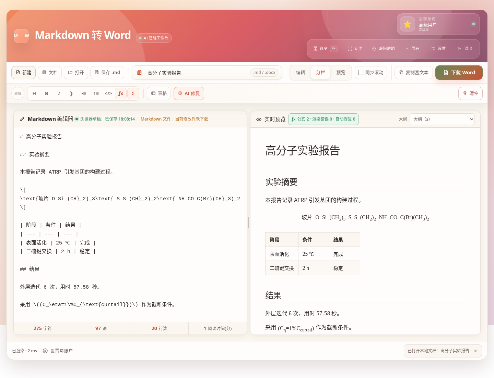
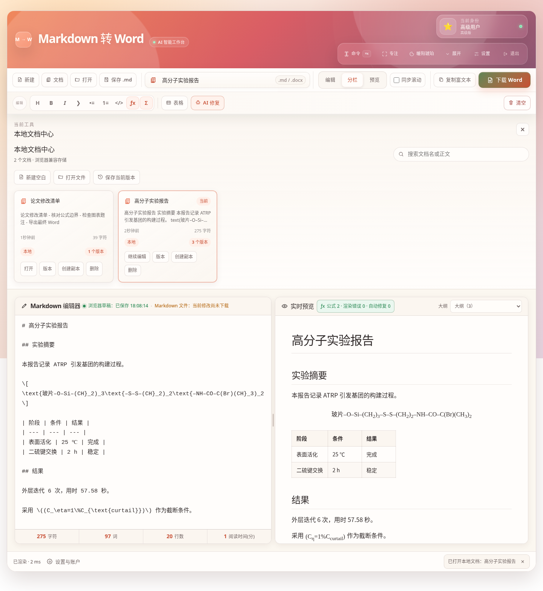
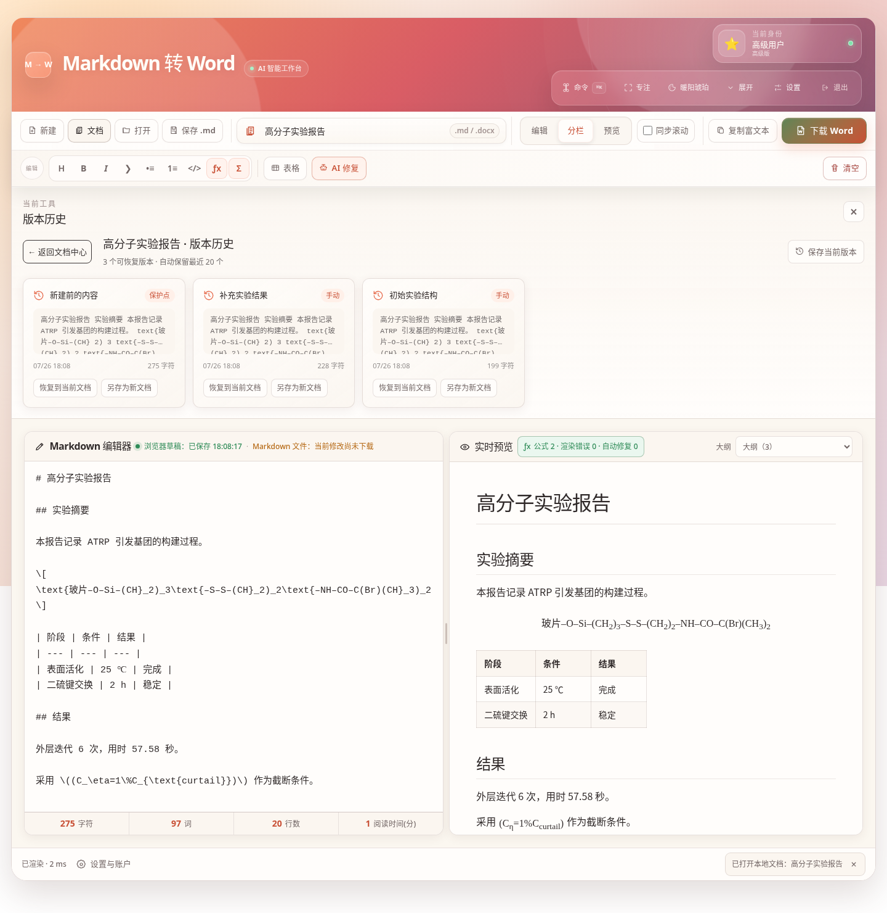
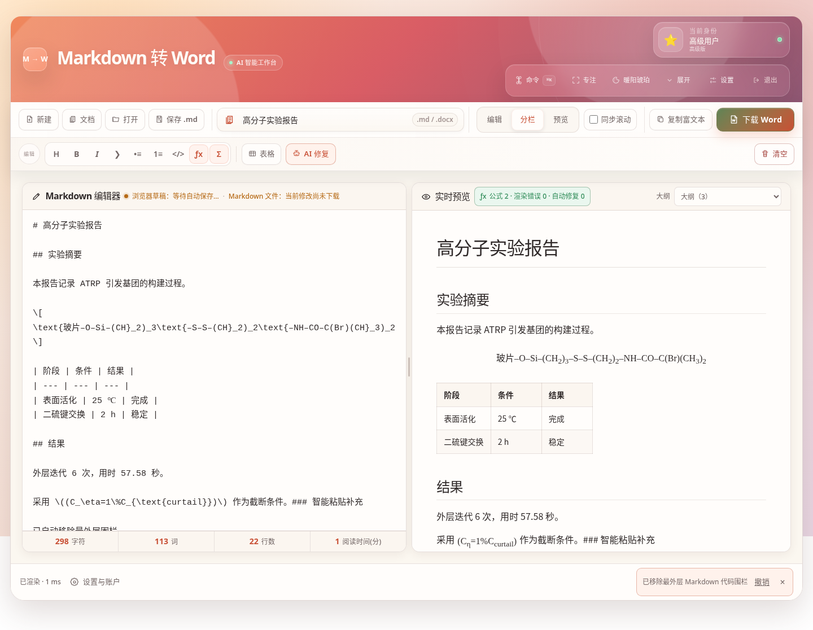
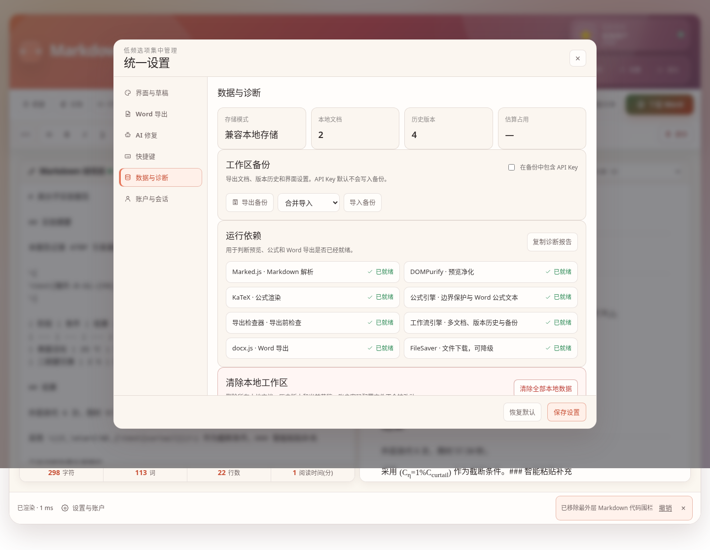

# AI 智能 Markdown 转 Word · 融合体验版 v5.3

一个完全运行在浏览器中的 Markdown 编辑、实时预览与 Word 导出工作台。项目保留原版密码入口、玻璃态视觉、三种本地身份和四套主题，并在可靠公式、导出前检查与全局排版体系之上，新增多文档中心、版本历史、智能粘贴、工作区备份、依赖诊断和导出成功回执。

## v5.3 的重点：可靠工作流

### 多文档中心

每一份文档都有独立 ID、文档名、正文、修改时间、光标位置、编辑器与预览滚动位置、当前视图及历史版本。打开文件、新建文档或开始输入后，文档都会自动进入本地文档中心。

- 按名称或正文搜索；
- 打开、创建副本或删除；
- 查看最近修改时间、字符数和版本数量；
- 空白预览中显示最近文档；
- IndexedDB 优先，受限环境自动降级到 localStorage 或临时内存。

### 可恢复的版本历史

- 破坏性操作前自动创建保护点；
- 长时间编辑时按五分钟间隔创建自动版本；
- 支持手动保存当前版本；
- 默认保留最近 20 个版本；
- 可恢复到当前文档，也可把历史版本另存为新文档；
- 切换文档、恢复版本和异步保存之间采用串行写入，避免版本落到错误文档。

### 智能粘贴

在编辑器中粘贴时，可自动处理高置信度内容：

- 去掉 AI 回复最外层多余的 Markdown 代码围栏；
- 将 Excel、表格软件复制出的 TSV 转为 Markdown 表格；
- 将网页或 Word 富文本中的标题、粗体、列表、链接、引用、代码和表格转换为 Markdown；
- 统一 Windows 换行；
- 处理后提供一键撤销；
- 普通文本保持原样。

### 工作区备份与诊断

`设置 → 数据与诊断` 提供：

- 导出全部文档、版本历史和界面设置；
- 合并导入或替换导入 JSON 备份；
- API Key 默认不写入备份，可显式选择包含；
- 查看当前存储模式、文档数、版本数和浏览器存储估算；
- 检查 Marked、DOMPurify、KaTeX、公式引擎、导出检查器、工作流引擎、docx.js 和 FileSaver 的加载状态；
- 一键复制诊断报告；
- 两次确认后清除本地文档、版本和草稿。

### 更专注的工作区

- 空白文档时保留完整品牌区；
- 开始编辑后自动收起为紧凑标题栏；
- 可设置为始终展开或始终紧凑；
- 高频操作统一使用线性 SVG 图标；
- Word 导出成功后显示非阻塞回执，包括文件名、公式、表格、图片、提醒和耗时。

## 可靠公式链路

公式会在 Markdown 解析前被提取和保护，因此 `\[...\]`、`\(...\)` 不会再被 Marked 当作普通反斜杠转义处理。

支持：

```text
行内：$x_1$ 或 \(x_1\)
独立：$$...$$ 或 \[...\]
```

兼容 AI 输出中的两类常见退化：

```latex
[
\text{玻片–O–Si–(CH}_2)_3
]
```

以及：

```latex
(C_\eta=1%C_{\text{curtail}})
```

高置信度裸公式会自动补充边界，并把数值百分号规范为 `\%`。公式诊断可显示公式数量、渲染错误、自动修复原因，并一键定位原始 Markdown 范围或写回标准语法。

## Word 导出

- 导出前检查公式、未闭合边界、代码围栏、标题层级、链接、图片和超宽表格；
- Word 下载按钮直接显示“可导出、提醒或错误”状态；
- 化学式、变量下标和常见上标会生成可编辑 docx.js `TextRun`；
- 不再插入“请手动添加公式”的占位提示；
- 文档名统一控制 `.md` 与 `.docx` 文件名；
- 浏览器草稿状态和 Markdown 文件下载状态明确分开。

复杂分式、矩阵、积分和多行方程当前仍会转换为可编辑线性文本，而不是 Word 原生 OMML 公式对象。

## 界面与交互

- 原版双栏编辑/预览模式；
- 常驻 Command Deck，Word 是唯一高亮主按钮；
- 编辑、分栏、预览三种视图；
- 桌面与手机分别记忆视图；
- 可拖动分隔条并记忆宽度；
- 可关闭的同步滚动；
- 预览顶部大纲下拉框；
- 统一八级字体系统和紧凑、标准、宽松三种密度；
- `Ctrl / Command + K` 全局命令面板；
- `Ctrl / Command + Shift + F` 专注模式；
- AI 选区或全文修复；
- TSV、CSV 与 Markdown 表格转换。

## 默认本地身份

| 密码 | 身份 |
|---|---|
| `basic123` | 基础用户 |
| `517517` | 高级用户 |
| `lingling` | 超级管理员 |

三个身份都可以使用核心编辑、公式与导出能力。密码和身份名称统一在 `js/access-config.js` 中修改。

## 本地数据说明

工作流优先使用 IndexedDB。若 IndexedDB 不可用，则尝试 localStorage；两者都被浏览器禁用时，会降级为当前页面的临时内存，并明确显示“关闭页面后失效”。

v5.3 保留旧版单草稿键用于兼容迁移，新文档中心使用独立数据库和存储键，不会主动清除已有主题、视图、AI 配置或本机自动进入状态。

## 快速使用

1. 输入密码进入工作区；
2. 新建、打开或从文档中心继续一份文档；
3. 粘贴或输入 Markdown；
4. 在预览区确认公式和结构；
5. 查看 Word 按钮的导出就绪状态；
6. 点击“下载 Word”。

常用快捷键：

```text
Ctrl / Command + K           命令面板
Ctrl / Command + O           打开 Markdown
Ctrl / Command + S           下载 Markdown
Ctrl / Command + D           下载 Word
Ctrl / Command + Enter       复制富文本
Ctrl / Command + Shift + F   专注模式
Ctrl / Command + B           粗体
Ctrl / Command + I           斜体
Alt + M                      插入独立公式
```

## 本地运行

```bash
git clone https://github.com/zxcgzx/markdown-to-word-converter.git
cd markdown-to-word-converter
python -m http.server 8000
```

浏览器打开 `http://localhost:8000`。

页面目前通过 CDN 加载 Marked、DOMPurify、KaTeX、docx.js 和 FileSaver，首次打开及 Word 导出需要网络可访问这些依赖。

## 自动检查

```bash
npm run check
npm test
```

- `npm run check`：检查五个 JavaScript 文件语法；
- `npm test`：运行公式、导出检查、工具栏、排版、工作流、备份与静态结构测试。

发布版另外完成 Chromium 浏览器回归、多个响应式宽度、受限存储降级和 ZIP 解压复测。完整记录见 [质量检查报告](docs/QA_REPORT.md)。

## 项目结构

```text
.
├── index.html
├── css/
│   ├── app.css
│   ├── toolbar.css
│   ├── experience.css
│   ├── hero.css
│   ├── typography.css
│   └── workflow.css
├── js/
│   ├── access-config.js
│   ├── math-engine.js
│   ├── preflight.js
│   ├── workflow.js
│   └── app.js
├── tests/
├── docs/
│   ├── UPDATE_GUIDE.md
│   ├── QA_REPORT.md
│   └── screenshots/
├── package.json
└── .github/workflows/deploy.yml
```

## 界面预览

### 工作区



### 多文档中心



### 版本历史



### 智能粘贴



### 数据与诊断



### 手机工作区


## 已知边界

- 网络图片和相对路径图片目前不会自动下载并嵌入 Word；导出检查会提示，`data:image/...` 图片可直接嵌入；
- 复杂数学公式不是 Word 原生 OMML；
- AI 请求取决于服务商接口、模型、API Key、配额和 CORS；
- 纯前端密码入口用于保留个人工作流和界面体验；
- 外部 CDN 受网络环境影响。

## License

MIT
