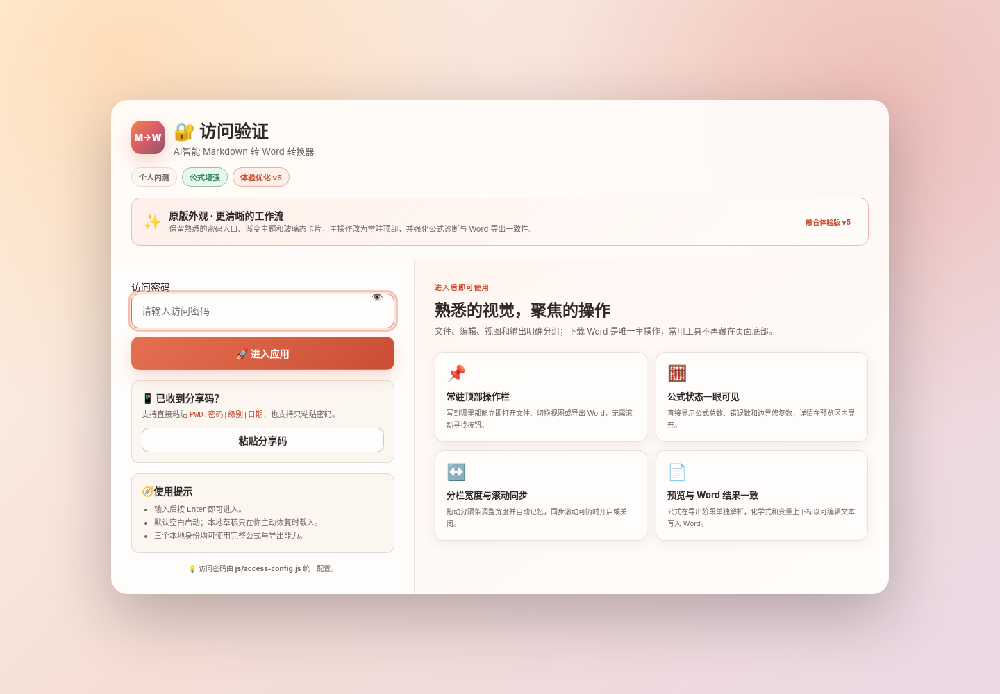
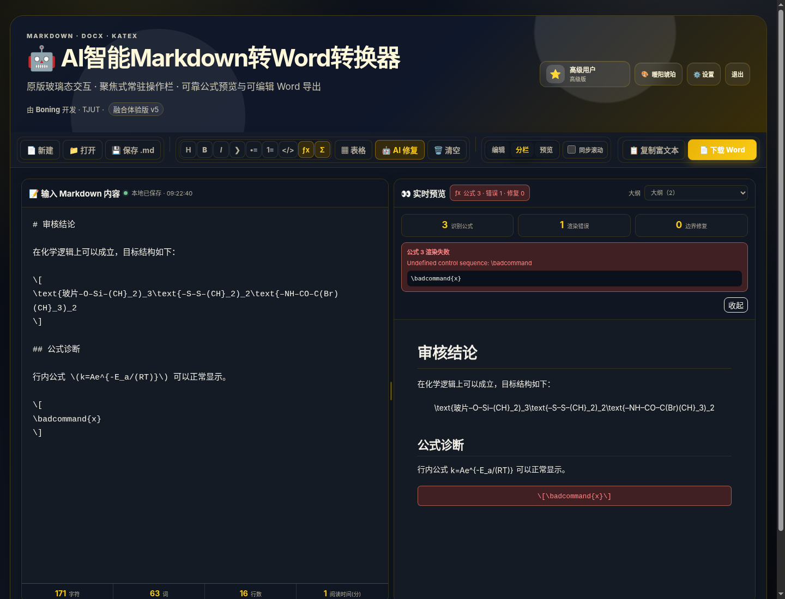
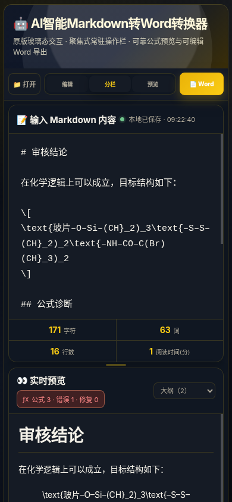

# AI 智能 Markdown 转 Word · 融合体验版 v5

这是一个完全在浏览器中运行的 Markdown 编辑、实时预览与 Word 导出工具。v5 保留原版的密码入口、玻璃态卡片、渐变标题区、用户身份和四套主题，同时把日常工作流重整为“打开或输入 → 检查预览 → 下载 Word”。

本版重点不是再增加一层功能，而是让常用功能更容易找到、减少打断，并让公式预览、诊断与 Word 导出保持一致。

## 界面预览

### 密码入口



### 桌面端工作区



### 移动端工作区



## 本次落地的 11 项体验改进

| 原有问题 | v5 的处理方式 |
| --- | --- |
| 主操作位于编辑区下方或分散在多个功能组 | 增加常驻顶部操作栏；“下载 Word”是页面唯一的主按钮，滚动到任何位置都可直接导出。 |
| AI、上传、草稿、表格、账号、主题等按钮视觉权重接近 | 顶部按“文件、编辑、视图、输出”分组；账户、主题和设置归入标题区或统一设置。 |
| 打开页面自动载入示例 | 默认空白启动；公式示例与草稿恢复只出现在空预览区。可在设置中主动开启启动恢复草稿。 |
| 浮动缩略导航遮挡状态和按钮 | 完全移除悬浮缩略图，改为预览区标题栏中的“大纲”下拉框。 |
| 左右栏宽度固定 | 增加可拖动分隔条，桌面与移动端宽度分别记忆；双击分隔条恢复均分。 |
| 编辑与预览滚动不同步 | 增加可随时开关的按比例同步滚动。 |
| 公式失败时只显示源码 | 状态直接显示“公式数量 · 错误数量 · 修复数量”；点击后展开具体错误、源公式和边界修复信息。 |
| Toast、配额、权限提示过多 | 普通反馈统一进入底部紧凑状态栏；只有真正的错误才弹出错误卡片；移除配额和非任务型提示。 |
| AI、表格、帮助等多层模态框打断操作 | AI 与表格作为工作区内联工具展开；主题、草稿、Word、AI 配置、快捷键和账户集中到唯一的“统一设置”窗口。 |
| 移动端顶部按钮过多 | 680 像素以下只保留“打开、视图切换、下载 Word”；低频设置放在底部“设置与账户”。 |
| 预览能显示公式，Word 却插入占位提示 | 导出阶段重新解析公式，化学式、变量上下标和常用符号写成可编辑的 Word 文本运行。 |

## 保留的原版体验

- 密码验证、密码显示切换、Enter 登录和分享码粘贴。
- 基础用户、高级用户、超级管理员三种本地身份显示。
- 暖阳琥珀、经典浅林、现代黑金、极光幻彩四套主题，并支持跟随系统。
- 原版风格的玻璃态卡片、渐变标题区和双栏编辑预览。
- 本地草稿、文件拖放、Markdown 下载、富文本复制、AI 修复和表格转换。

三个身份目前都可使用全部核心功能。身份等级仅保留原来的入口体验和状态展示，不限制公式、AI 或导出能力。

## 默认访问密码

密码统一配置在 `js/access-config.js`：

| 密码 | 显示身份 |
| --- | --- |
| `basic123` | 基础用户 |
| `517517` | 高级用户 |
| `lingling` | 超级管理员 |

修改示例：

```js
window.MD2WORD_ACCESS = Object.freeze({
    sessionKey: 'md2word.fusion.auth.v5',
    users: Object.freeze({
        '我的密码': Object.freeze({
            level: 'advanced',
            name: '我的身份',
            icon: '⭐',
            label: '个人版'
        })
    })
});
```

对象键包含数字或特殊字符时应使用引号。

## 推荐工作流

1. 输入密码进入应用。
2. 直接粘贴 Markdown，或点击顶部“打开”。
3. 使用“编辑 / 分栏 / 预览”切换工作方式；需要时拖动中间分隔条。
4. 在预览标题栏查看公式状态和文档大纲。
5. 点击唯一的黄色主按钮“下载 Word”。

常用快捷键：

| 快捷键 | 功能 |
| --- | --- |
| `Ctrl / Command + O` | 打开 Markdown 文件 |
| `Ctrl / Command + S` | 下载 `.md` |
| `Ctrl / Command + D` | 下载 Word |
| `Ctrl / Command + Enter` | 复制富文本 |
| `Ctrl / Command + B` | 粗体 |
| `Ctrl / Command + I` | 斜体 |
| `Ctrl / Command + /` | 打开统一设置中的快捷键区域 |
| `Alt + M` | 插入独立公式 |
| 双击分隔条 | 恢复左右均分 |

## 公式处理与诊断

旧流程容易在 Markdown 解析阶段先吞掉公式边界：

```text
Markdown 原文 → marked.parse() → KaTeX 再查找公式
```

例如：

```latex
\[
\text{玻片–O–Si–(CH}_2)_3
\]
```

可能先退化成普通的 `[ ... ]` 文本。v5 改为：

```text
排除代码区域
→ 提取并保护公式
→ Markdown 解析与净化
→ 恢复公式占位符
→ KaTeX 渲染
```

支持：

- `$...$`
- `$$...$$`
- `\(...\)`
- `\[...\]`
- AI 输出中已经退化的独立 `[ ... ]` TeX 块

预览标题栏会显示：

```text
公式 3 · 错误 1 · 修复 0
```

点击状态可查看具体错误、原始公式、自动边界修复和写回标准 `\[ ... \]` 的操作。代码块与行内代码里的公式符号不会被误转换。

## Word 公式导出

导出 DOCX 时不会读取 KaTeX 的视觉 DOM，也不会插入“请在 Word 中手动添加公式”的占位提示。公式会在导出阶段单独解析，并转换为可编辑文本运行：

- `_2`、`_3` 等转换为 Word 下标。
- `^2`、`^{n}` 等转换为 Word 上标。
- 化学式、变量和常见运算符保持可编辑。
- 标题、段落、列表、引用、表格、代码块和链接按 Word 结构生成。

当前目标是“可读、可编辑、上下标正确”。复杂分式、矩阵、积分和多行方程会以可读线性文本保留，而不是 Word 原生 OMML 公式对象。

## AI 与表格工具

- 顶部“AI 修复”直接处理当前选区；没有选区时处理全文。
- AI 服务商、接口、模型、API Key 和默认模式集中在“统一设置”。
- AI 结果在工作区内联显示，可对比、编辑、复制或应用，不再弹出多层窗口。
- 表格工具支持 TSV、CSV 和 Markdown 表格的转换、预览与插入。
- API 配置只保存在当前浏览器。实际请求能否成功取决于服务商接口、模型、Key 和浏览器跨域策略。

## 草稿与启动行为

- 默认启动为空白文档。
- 自动保存可继续开启，但不会强制把旧草稿覆盖到编辑区。
- 检测到本地草稿时，空预览区会显示“恢复草稿”。
- 需要恢复原行为时，可在统一设置中开启“启动时自动恢复草稿”。

## 移动端行为

在 680 像素及以下宽度：

- 顶部常驻栏只显示“打开、编辑/分栏/预览、下载 Word”。
- 主题、账户、AI、表格和格式按钮不挤占顶部空间。
- 统一设置与退出入口位于底部“设置与账户”。
- 页面与操作栏均避免横向溢出。

## 本地运行

项目无需构建。建议通过 HTTP 服务打开：

```bash
python -m http.server 8000
```

然后访问：

```text
http://localhost:8000
```

页面运行时通过 CDN 加载 Marked、DOMPurify、KaTeX、docx.js 和 FileSaver，首次打开需要能访问相应 CDN。

## 自动测试

安装 Node.js 后，在项目根目录运行：

```bash
npm test
npm run check
```

当前共有 21 项测试，覆盖：

- 密码入口、身份显示和四套主题。
- 常驻操作栏的四组结构及唯一主按钮。
- 空白启动、空预览示例和草稿恢复入口。
- 大纲下拉框和旧悬浮缩略图彻底移除。
- 分隔条宽度记忆和同步滚动。
- 公式数量、错误、修复与展开诊断。
- 只有一个低频设置对话框，AI 和表格保持内联。
- 移动端顶部只保留打开、视图和 Word。
- 普通反馈进入状态栏，只有错误生成 Toast。
- DOCX 公式生成可编辑上下标运行。
- 四种公式边界、松散方括号修复、代码区域排除和货币符号排除。

## 项目结构

```text
.
├── index.html
├── css/
│   └── app.css
├── js/
│   ├── access-config.js
│   ├── app.js
│   └── math-engine.js
├── tests/
│   ├── fusion-static.test.js
│   └── math-engine.test.js
├── docs/
│   ├── screenshots/
│   ├── UPDATE_GUIDE.md
│   └── QA_REPORT.md
├── .github/workflows/deploy.yml
├── package.json
├── CHANGELOG.md
└── LICENSE
```

## 浏览器兼容性

建议使用当前版本的 Chrome、Edge 或 Firefox。页面使用 `<dialog>`、Clipboard API、File API、Pointer Events 和浏览器下载能力，较旧浏览器的体验可能不完整。

## License

MIT
