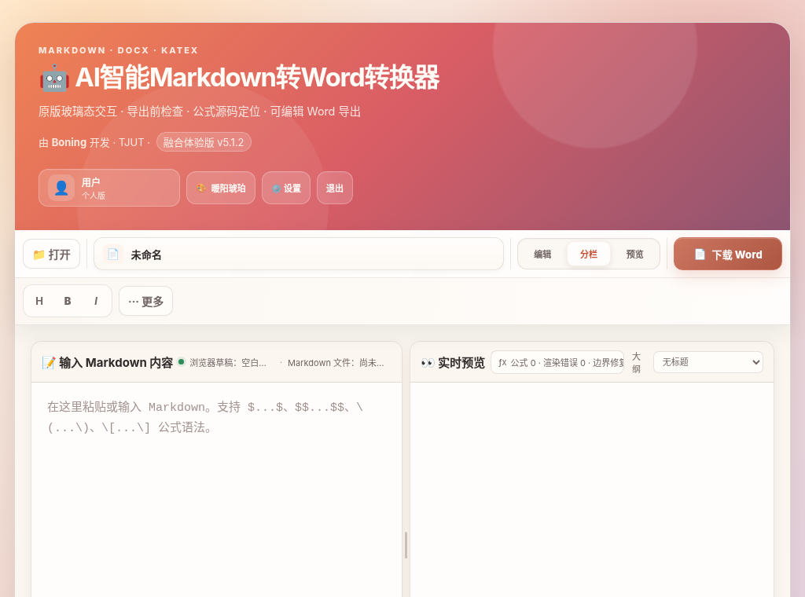
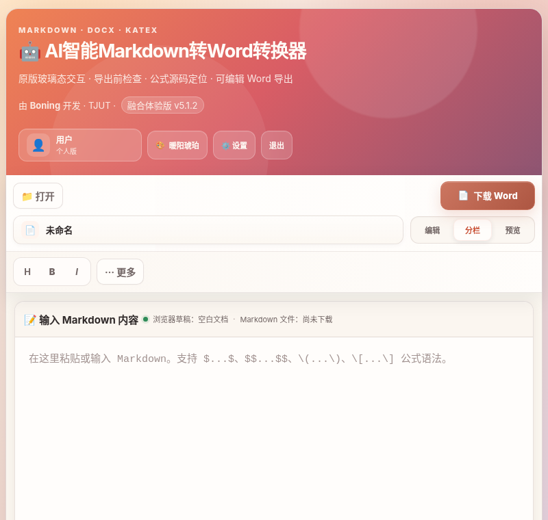
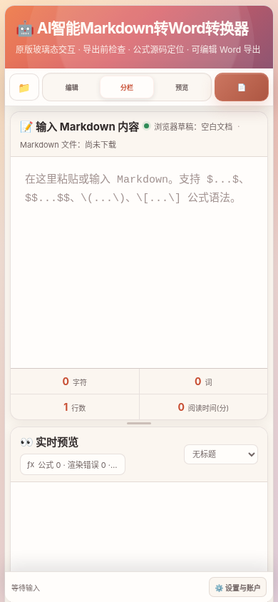
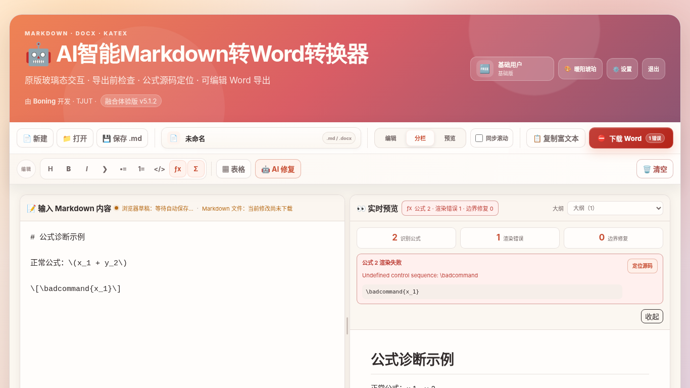

# AI 智能 Markdown 转 Word · 融合体验版 v5.1.2

一个完全在浏览器中运行的 Markdown 编辑、实时预览与 Word 导出工具。它保留原版密码入口、渐变标题、玻璃态卡片、用户身份与四套主题，同时提供可靠的公式预处理、导出前检查、公式源码定位、可编辑 Word 上下标、AI 修复和表格转换。

v5.1.2 专门重构了顶部操作区：不再把多个“卡片”机械堆叠，而是使用一块连续的 **Command Deck**，将文档操作与编辑操作分层，并针对桌面、窄桌面、平板和手机分别安排布局。

无需后端，也无需构建。打开静态页面即可使用；AI 修复属于可选能力。

## 界面预览

### 密码入口


### 桌面端 Command Deck


### 1024 像素紧凑布局与“更多”菜单




### 800 像素平板布局



### 390 像素移动端



### 公式诊断与源码定位



## v5.1.2 顶部操作区优化

### 1. 单一连续操作面，而不是多块卡片堆叠

工具栏现在分成两条清晰的操作路径：

```text
文档行：文件操作 · 文档名 · 视图 · 输出
编辑行：常用格式 · 表格 · AI 修复 · 更多 · 清空
```

- 组容器不再层层套边框，减少视觉噪声；
- 文档名占据可伸缩的中心区域；
- 视图切换采用独立分段控件；
- “下载 Word”仍是唯一高亮主按钮；
- “清空”保持在编辑行最右端，并使用弱危险色降低误触。

### 2. 从结构上解决横向挤压和遮挡

v5.1.2 新增独立的 `css/toolbar.css`，在 `app.css` 之后加载，并带版本查询参数。关键布局使用明确的全宽行和命名网格区域：

```text
file | name | view | output
```

这同时解决两类问题：

- 旧样式缓存导致文档行与编辑行被当成两个横向项目；
- 输出区域覆盖视图按钮，出现“看得到但点不到”。

`app.css`、`toolbar.css` 和本地脚本均使用 `?v=5.1.2` 进行缓存刷新。覆盖更新后无需手动清理浏览器缓存即可优先获取新布局文件。

### 3. 响应式布局不再只是隐藏按钮

| CSS 宽度 | 布局 |
| --- | --- |
| 1321 px 以上 | 两条完整工具行，常用操作全部直接可见 |
| 1181～1320 px | 保存 Markdown、复制富文本进入“更多”，主流程保持单行 |
| 901～1180 px | 保留打开、文档名、视图、Word，以及 H/B/I/更多 |
| 681～900 px | 文档行改成平衡的 `2 × 2` 网格：打开/Word、文档名/视图 |
| 680 px 以下 | 只保留打开、三种视图和 Word 下载 |

平板布局不会再形成长长的左侧纵向堆栈；手机工具栏始终保持一行并且没有横向溢出。

### 4. 文档名更像真正的文档入口

文档名区域新增文档图标、独立焦点态与扩展名胶囊。它仍统一控制 `.md` 和 `.docx` 文件名，但在视觉上与普通按钮明确区分。

### 5. “更多”菜单补齐隐藏操作

当顶部空间不足时，“更多”中包含：

- 下载 Markdown；
- 复制富文本；
- 引用、列表与代码；
- 行内公式和独立公式；
- 表格转换；
- AI 修复；
- 清空内容；
- 统一设置。

菜单关闭时完全退出布局，打开后限制高度并可内部滚动。

## 核心体验能力

### 导出前检查

“下载 Word”会实时表达文档状态，并检查：

- KaTeX 渲染错误；
- 未闭合公式边界；
- 未闭合代码围栏；
- 复杂公式线性化提醒；
- 标题层级跳跃；
- 超宽 Markdown 表格；
- 空链接、空图片地址和外部图片兼容性。

存在问题时，首次点击不会直接下载，而是在工作区内打开检查结果。可定位问题可以跳回对应 Markdown，也可以明确选择“仍然导出”。

### 公式识别、诊断与源码定位

公式会在 Marked 解析前被保护，支持：

```text
$...$
$$...$$
\(...\)
\[...\]
```

也能识别 AI 输出中退化成独立 `[ ... ]` 的 TeX 块。代码围栏和行内代码中的公式标记不会被误处理。

状态示例：

```text
公式 3 · 渲染错误 1 · 边界修复 0
```

诊断项和预览中的错误公式都可一键定位并选中原始源码。

### Word 中的可编辑公式文本

DOCX 导出会单独解析公式：

- `_2`、`_{12}` 生成 Word 下标；
- `^2`、`^{n}` 生成 Word 上标；
- 化学式、变量与常用符号保持可编辑；
- 不再插入“请手动添加公式”的占位提示。

复杂分式、矩阵、积分和多行方程目前以线性可编辑文本保留，并在导出检查中给出提醒；尚不是 Word 原生 OMML 对象。

### 文档名与两种保存状态

顶部文档名同时用于 Markdown 和 Word 文件名。状态明确区分：

- **浏览器草稿**：自动保存到当前浏览器；
- **Markdown 文件**：用户已经主动下载 `.md`。

默认空白启动，本地草稿只在空预览区提供恢复入口，除非用户在设置中启用启动时自动恢复。

### 编辑、视图和长文操作

- 编辑、分栏、预览三种模式；
- 桌面端和移动端分别记忆视图；
- 可拖动、可键盘调整、可双击重置的分隔条；
- 分栏比例按桌面和移动端分别保存；
- 可关闭的编辑与预览同步滚动；
- 预览顶部大纲下拉框；
- 自动保存、清空后撤销、拖放文件和富文本复制。

### AI 与表格工具

- AI 优先处理当前选区，没有选区时处理全文；
- AI 配置集中在统一设置中；
- AI 结果在工作区内联比较、复制或应用；
- 表格工具支持 TSV、CSV 和 Markdown 表格转换与插入；
- API 配置只保存在当前浏览器。

## 保留的原版模式

- 密码验证、密码显示切换、Enter 登录和分享码粘贴；
- 基础用户、高级用户、超级管理员三种本地身份；
- 暖阳琥珀、经典浅林、现代黑金、极光幻彩四套主题；
- 原版风格的渐变标题区、玻璃态卡片和双栏工作区。

三个身份均能使用完整核心功能，等级只用于保留入口体验和身份显示。

## 默认访问密码

密码统一配置在 `js/access-config.js`：

| 密码 | 显示身份 |
| --- | --- |
| `basic123` | 基础用户 |
| `517517` | 高级用户 |
| `lingling` | 超级管理员 |

示例：

```js
window.MD2WORD_ACCESS = Object.freeze({
    sessionKey: 'md2word.fusion.auth.v5.1',
    users: Object.freeze({
        '我的密码': Object.freeze({
            level: 'advanced',
            name: '我的身份',
            icon: '⭐',
            label: '个人版'
        })
    })
});
```

v5.1.2 沿用 v5.1 的会话、设置、桌面视图和移动视图存储键，因此覆盖升级不会因为本次工具栏调整主动清除已有本地设置。

## 推荐工作流

1. 输入密码进入应用；
2. 粘贴 Markdown 或点击“打开”；
3. 在文档名区域确认输出文件名；
4. 使用编辑、分栏或预览检查内容；
5. 查看公式状态和 Word 按钮就绪状态；
6. 有问题时定位源码并修复；
7. 检查通过后下载 Word。

## 快捷键

| 快捷键 | 功能 |
| --- | --- |
| `Ctrl / Command + O` | 打开 Markdown 文件 |
| `Ctrl / Command + S` | 下载 `.md` |
| `Ctrl / Command + D` | 下载 Word |
| `Ctrl / Command + Enter` | 复制富文本 |
| `Ctrl / Command + B` | 粗体 |
| `Ctrl / Command + I` | 斜体 |
| `Ctrl / Command + /` | 打开快捷键设置 |
| `Alt + M` | 插入独立公式 |
| 双击分隔条 | 恢复左右均分 |

## 本地运行

项目无需构建，建议通过本地 HTTP 服务打开：

```bash
python -m http.server 8000
```

访问：

```text
http://localhost:8000
```

页面通过 CDN 加载 Marked、DOMPurify、KaTeX、docx.js 和 FileSaver，首次打开需要能够访问对应 CDN。

## 自动检查

```bash
npm test
npm run check
```

v5.1.2 包含 **55 项 Node 自动测试**：

- 页面结构、入口和工作流：16 项；
- 公式引擎：16 项；
- 导出前检查：15 项；
- Command Deck 工具栏：8 项。

发布前另外完成：

- 31 项浏览器功能回归；
- 24 个关键宽度的布局矩阵检查；
- 可见控件中心点命中检查；
- HTML、CSS、本地资源和 ZIP 完整性检查；
- 解压后重新执行测试。

详情见 [`docs/QA_REPORT.md`](docs/QA_REPORT.md)。

## 项目结构

```text
.
├── index.html
├── css/
│   ├── app.css
│   └── toolbar.css
├── js/
│   ├── access-config.js
│   ├── app.js
│   ├── math-engine.js
│   └── preflight.js
├── tests/
│   ├── fusion-static.test.js
│   ├── math-engine.test.js
│   ├── preflight.test.js
│   └── toolbar-layout.test.js
├── docs/
│   ├── screenshots/
│   ├── UPDATE_GUIDE.md
│   └── QA_REPORT.md
├── .github/workflows/deploy.yml
├── package.json
├── CHANGELOG.md
└── LICENSE
```

## 浏览器兼容性与最终验收

建议使用当前版本的 Chrome、Edge 或 Firefox。页面使用 `<dialog>`、Clipboard API、File API、Pointer Events 和浏览器下载能力。

自动化检查无法替代所有真实环境组合。部署后仍建议完成三项人工验收：

1. 确认实际网络可以加载所有 CDN 依赖；
2. 用实际使用的 Microsoft Word 或 WPS 打开一份包含化学式的 DOCX；
3. 使用自己的 AI 服务商、模型和 API Key 完成一次真实请求。

## License

MIT
