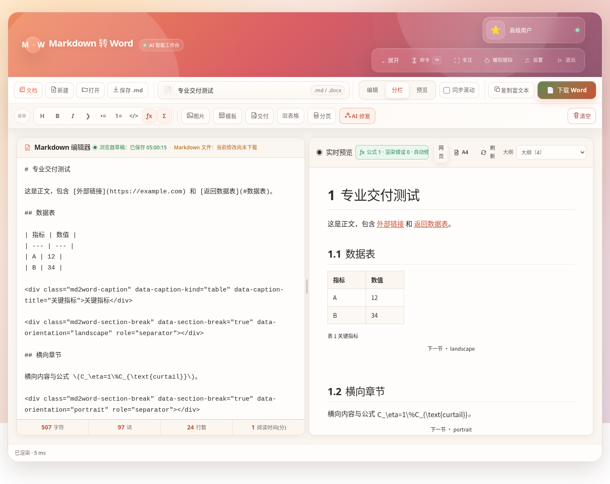
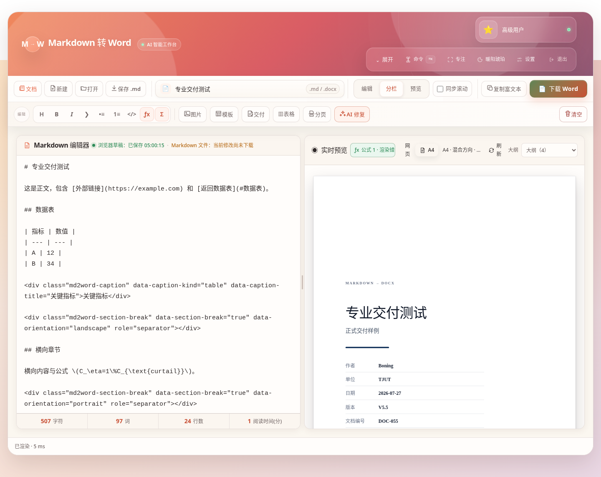
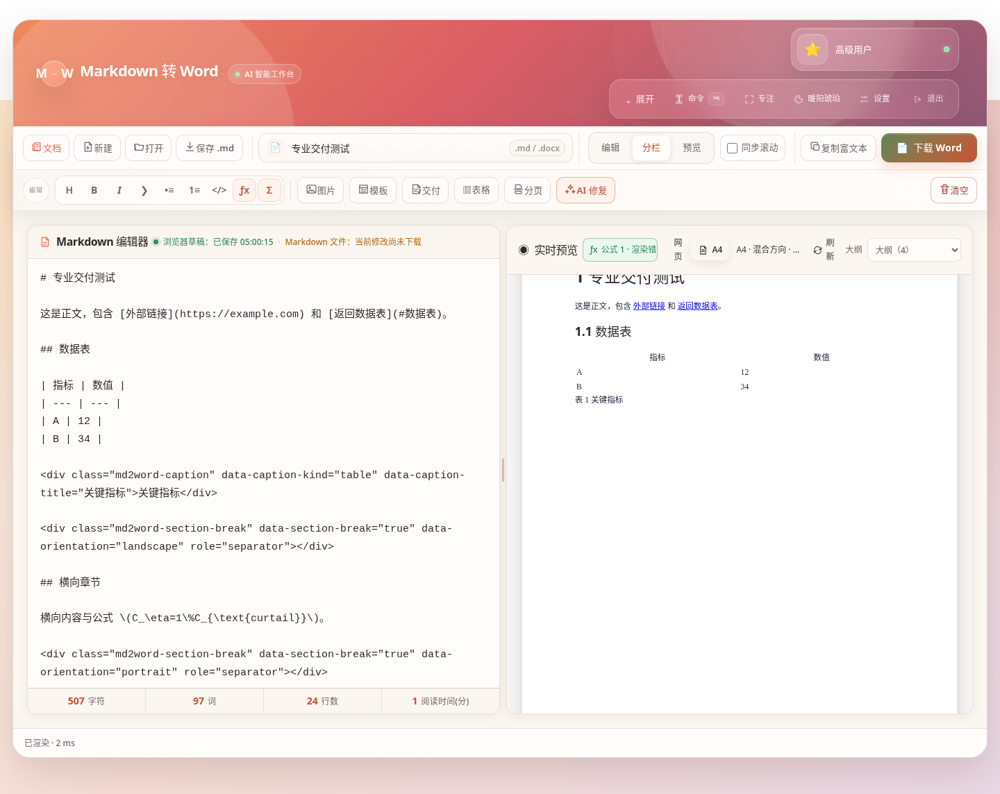
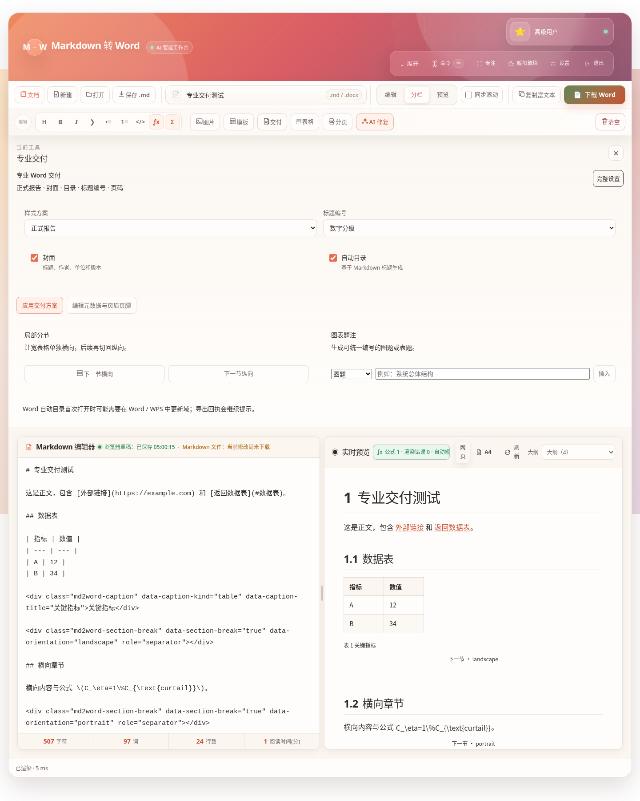
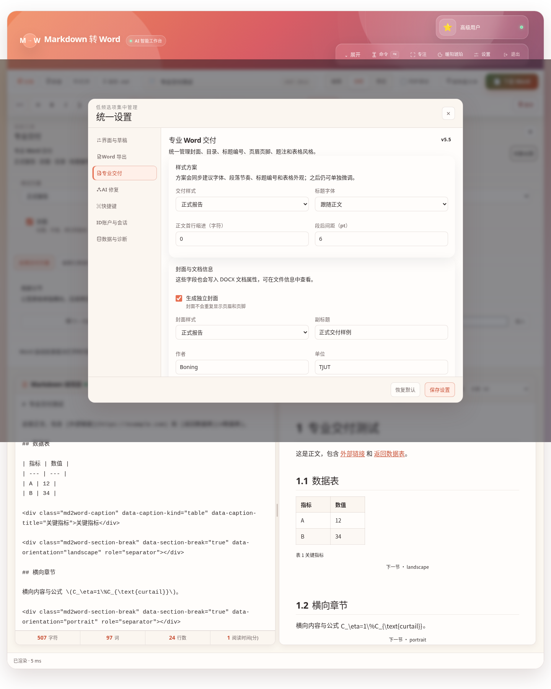
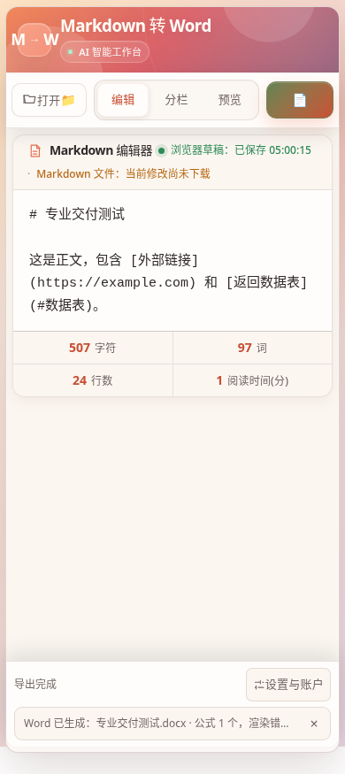

# AI 智能 Markdown 转 Word · 融合体验版 v5.5

一个无需后端的个人 Markdown 文档工作台。它保留原版密码入口、玻璃态主题和左右分栏体验，并把公式处理、多文档、版本历史、图片素材、A4 页面预览与专业 Word 交付整合在同一个纯前端页面中。

v5.5 的目标不是继续增加零散按钮，而是让生成的 DOCX 更接近可直接提交、打印或归档的正式文档。



## v5.5 新增：专业 Word 交付

### 封面与文档属性

可以生成独立封面，并配置：

- 副标题；
- 作者；
- 单位；
- 日期；
- 版本；
- 文档编号；
- 密级或状态。

这些信息不仅显示在封面上，也会写入 DOCX 文档属性。封面默认不显示正文页眉和页脚。



### 自动目录

根据 Markdown 的 H1–H6 标题生成 Word 自动目录，可设置：

- 目录标题；
- 目录深度；
- 是否启用超链接；
- 是否在目录后自动分页。

首次用 Word 或 WPS 打开后，可能需要更新目录域，页码才会显示为最终结果。页面内的 A4 预览会先展示目录结构，但不会冒充 Word 的最终页码。

### Word 多级标题编号

支持：

```text
不编号
1 · 1.1 · 1.1.1
第一章 + 数字子级
```

编号使用 Word 多级编号配置，而不是把数字写死到 Markdown 正文，因此源文件仍保持干净。

### 页眉、页脚与页码

支持页眉和页脚占位符：

```text
{title}
{subtitle}
{author}
{organization}
{date}
{version}
{number}
{classification}
```

页码格式：

```text
1
1 / 12
第 1 页
第 1 页 / 共 12 页
```

页码可以左对齐、居中或右对齐，并支持正文首页不同。

### 局部横向与纵向分节

无需把整个文档都改成横向。可以在 Markdown 中插入分节标记：

```html
<div class="md2word-section-break"
     data-section-break="true"
     data-orientation="landscape"
     role="separator"></div>
```

之后的内容进入横向节；再插入 `portrait` 标记即可恢复纵向。A4 预览和 Word 导出都会识别这些分节。

快捷键：

```text
Alt + L：插入下一节横向
```



### 题注与专业表格

“交付”工具中可以插入图片或表格题注，并使用统一编号文本。Word 表格支持：

- 固定布局；
- 表头跨页重复；
- 尽量避免单行跨页拆分；
- 清晰蓝灰、正式灰阶、完整网格、学术、黑白打印和极简边线等样式。

### 书签与链接

Markdown 标题会生成 Word 书签。链接导出支持：

- 外部网页链接；
- 文档内部标题跳转；
- Word 超链接样式。

### 六套专业交付方案

| 方案 | 适用场景 |
|---|---|
| 简洁商务 | 项目报告和正式汇报 |
| 正式报告 | 中文正式材料和归档文档 |
| 学术论文 | 论文初稿和研究报告 |
| 实验记录 | 实验报告和研发记录 |
| 黑白打印 | 复印、归档和批量打印 |
| 内部 SOP | 有版本、编号和页眉页脚的流程文件 |

方案会提供字体、段落节奏、标题编号和表格外观建议；应用后仍可单独调整。





## 继续保留的可靠工作流

### 公式优先解析

在 Markdown 解析前保护公式边界，支持：

```text
$...$
$$...$$
\(...\)
\[...\]
```

同时兼容：

- AI 输出退化成独立 `[ ... ]` 的公式块；
- 括号中的高置信度裸行内 TeX；
- 数值百分号 `%` 自动规范为 `\%`；
- 中文全角括号和百分号；
- 代码块、行内代码和 HTML 属性排除；
- 公式错误一键定位源码；
- 标准公式边界写回。

化学式、变量上下标和常见符号会在 Word 中转换为可编辑文字与上下标运行。复杂分式、矩阵、积分和多行方程目前仍以可读线性形式导出，不是 Word 原生 OMML 公式对象。

### 导出前检查

下载 Word 前检查：

- 公式错误与未闭合边界；
- 代码围栏；
- 图片状态；
- 超宽表格和页面风险；
- 标题层级；
- 专业交付字段；
- 页眉、封面和目录配置。

问题可以直接定位回 Markdown 源码。用户也可以在了解风险后选择仍然导出。

### 多文档中心与版本历史

每份文档独立保存：

- Markdown 内容；
- 文档名；
- 光标和滚动位置；
- 视图与分栏比例；
- 图片素材；
- 历史版本。

AI 应用、清空、公式标准化、模板覆盖和历史恢复前会创建保护点。

### 图片素材与 Word 嵌入

支持：

- 粘贴截图；
- 拖入 PNG、JPG、GIF、WebP、SVG；
- 批量导入图片；
- 网络图片本地化；
- 每文档独立素材库；
- 图片尺寸选择；
- Word 内真实嵌入；
- 备份、复制文档和恢复时同步迁移素材。

网络图片是否能被嵌入取决于图片服务器是否允许浏览器跨域读取。失败项会进入导出检查。

### A4 / Letter 页面预览

支持网页预览和纸张预览，可同步：

- A4 或 Letter；
- 纵向或横向；
- 四边独立页边距；
- 字体、字号与行距；
- 显式分页；
- 混合方向分节；
- 封面、目录、页眉和页脚。

浏览器分页属于布局估算，最终分页仍以实际 Word 或 WPS 为准。

### 文档模板

内置：

- 通用报告；
- 实验报告；
- 论文初稿；
- 会议纪要；
- 标准操作规程；
- 横向数据表。

模板会同时给出推荐页面和 Word 设置。覆盖已有内容前会创建历史保护点。

### 智能粘贴

能够处理：

- AI 回复外层 Markdown 围栏；
- Excel / TSV 表格；
- Word 或网页富文本；
- 普通文本；
- 不可见危险 HTML。

自动转换后提供撤销入口。

### 工作区备份与诊断

可以导出或导入完整 JSON 工作区，包含：

- 文档；
- 历史版本；
- 图片素材；
- 主题和界面设置；
- Word 与专业交付配置；
- AI 配置。

API Key 默认不包含，只有用户主动勾选时才写入备份。

## 界面与操作

- 原版密码入口与三个本地身份；
- 暖阳琥珀、经典浅林、现代黑金、极光幻彩四套主题；
- 常驻两层 Command Deck；
- “下载 Word”是唯一主按钮；
- 编辑、分栏、预览三种视图；
- 桌面和手机独立记忆视图；
- 可拖动分隔条；
- 同步滚动；
- 大纲导航；
- 命令面板；
- 专注模式；
- 紧凑、标准、宽松三种界面密度；
- 移动端保留打开、视图切换和 Word 下载等必要操作。



## 默认密码

密码统一在 `js/access-config.js` 中管理。

| 密码 | 身份 |
|---|---|
| `basic123` | 基础用户 |
| `517517` | 高级用户 |
| `lingling` | 超级管理员 |

三个身份都可以使用核心转换能力。身份主要用于保留原版入口体验与状态显示。

## 常用快捷键

| 快捷键 | 操作 |
|---|---|
| `Ctrl / Command + O` | 打开 Markdown |
| `Ctrl / Command + Shift + O` | 打开文档中心 |
| `Ctrl / Command + S` | 下载 Markdown |
| `Ctrl / Command + D` | 下载 Word |
| `Ctrl / Command + Enter` | 复制富文本 |
| `Ctrl / Command + K` | 全局命令面板 |
| `Ctrl / Command + Shift + F` | 专注模式 |
| `Alt + M` | 插入独立公式 |
| `Alt + P` | 插入分页 |
| `Alt + L` | 插入横向分节 |

## 本地运行

```bash
git clone https://github.com/zxcgzx/markdown-to-word-converter.git
cd markdown-to-word-converter
python -m http.server 8000
```

浏览器打开：

```text
http://localhost:8000
```

项目不需要构建步骤。Marked、DOMPurify、KaTeX、docx.js 和 FileSaver 当前从 CDN 加载，因此首次打开和公式 / Word 功能需要网络。

## 自动测试

```bash
npm run check
npm test
```

当前发布包还执行 Chromium 集成回归、响应式矩阵、HTML / CSS 静态检查和 ZIP 解压复测。详细结果见：

- [质量检查报告](docs/QA_REPORT.md)
- [覆盖更新与验收指南](docs/UPDATE_GUIDE.md)
- [更新记录](CHANGELOG.md)

## 数据与升级

v5.5 继续沿用 v5.4 的工作区数据库和设置键，升级时不会主动删除已有文档、版本和图片素材。

仍建议在覆盖前：

1. 下载重要 Markdown；
2. 在“设置 → 数据与诊断”中导出工作区备份；
3. 整体覆盖仓库文件；
4. 发布后执行一次硬刷新。

## 当前边界

- A4 页面预览是浏览器估算，不等同于 Word 排版引擎；
- 自动目录首次打开后可能需要更新域；
- 复杂公式不是 Word 原生 OMML；
- 网络图片嵌入受 CORS 限制；
- 不同 Word / WPS 版本可能产生分页和字体回退差异；
- AI 请求取决于服务商接口、模型、配额和浏览器跨域环境。

## License

MIT
